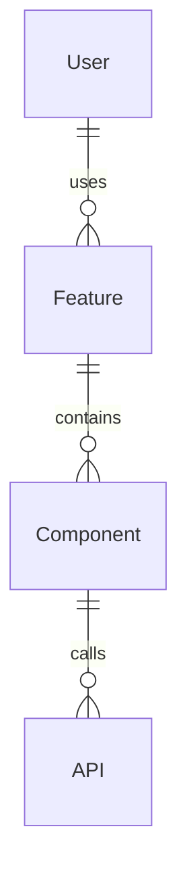

# 功能规范: {feature_name}

## 概述
**功能名称**: {feature_name}  
**版本**: 1.0.0  
**创建日期**: {date}  
**负责人**: {owner}  
**状态**: 草稿  

## 功能描述
{feature_description}

## 业务目标
- {business_goal_1}
- {business_goal_2}
- {business_goal_3}

## 用户故事
### 作为 {user_type}
我希望 {user_need}  
以便 {business_value}

## 功能需求 (FR)
### FR-1: {requirement_title}
**描述**: {requirement_description}  
**优先级**: 高/中/低  
**验收标准**: 
- {acceptance_criteria_1}
- {acceptance_criteria_2}

### FR-2: {requirement_title}
**描述**: {requirement_description}  
**优先级**: 高/中/低  
**验收标准**: 
- {acceptance_criteria_1}
- {acceptance_criteria_2}

## 非功能需求 (NFR)
### NFR-1: 性能
- 页面加载时间 < 2秒
- 支持并发用户数 > 1000

### NFR-2: 可用性
- 响应式设计，支持移动端和桌面端
- 无障碍访问支持

### NFR-3: 安全性
- 数据加密传输
- 用户身份验证

## 关键实体与关系

## 测试/验收条件
### 单元测试
- [ ] {test_case_1}
- [ ] {test_case_2}

### 集成测试
- [ ] {integration_test_1}
- [ ] {integration_test_2}

### 端到端测试
- [ ] {e2e_test_1}
- [ ] {e2e_test_2}

## 风险与未决项
### 技术风险
- {technical_risk_1}
- {technical_risk_2}

### 业务风险
- {business_risk_1}
- {business_risk_2}

### 未决项
- [ ] {open_question_1}
- [ ] {open_question_2}

## 依赖关系
### 前置条件
- {prerequisite_1}
- {prerequisite_2}

### 后续功能
- {dependent_feature_1}
- {dependent_feature_2}

## 验收标准
- [ ] 所有功能需求已实现并通过测试
- [ ] 所有非功能需求已满足
- [ ] 代码审查通过
- [ ] 文档已更新
- [ ] 用户验收测试通过
