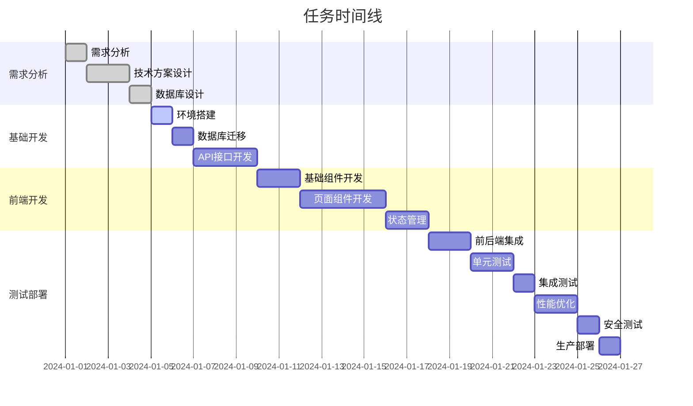

# 任务清单: {feature_name}

## 概述
**功能名称**: {feature_name}  
**任务版本**: 1.0.0  
**创建日期**: {date}  
**负责人**: {assignee}  
**预计完成时间**: {due_date}  

## 任务概览
- **总任务数**: {total_tasks}
- **已完成**: {completed_tasks}
- **进行中**: {in_progress_tasks}
- **待开始**: {pending_tasks}
- **完成率**: {completion_rate}%

## 任务列表

### 阶段1: 需求分析与设计
- [ ] **TASK-001**: 需求分析
  - **描述**: 详细分析功能需求，明确业务目标
  - **优先级**: 高
  - **预估工时**: 4小时
  - **依赖**: 无
  - **验收标准**: 需求文档完成，业务目标明确

- [ ] **TASK-002**: 技术方案设计
  - **描述**: 设计技术架构和实现方案
  - **优先级**: 高
  - **预估工时**: 8小时
  - **依赖**: TASK-001
  - **验收标准**: 技术方案文档完成，架构图清晰

- [ ] **TASK-003**: 数据库设计
  - **描述**: 设计数据库表结构和关系
  - **优先级**: 高
  - **预估工时**: 6小时
  - **依赖**: TASK-002
  - **验收标准**: 数据库ER图完成，表结构定义清晰

### 阶段2: 基础开发
- [ ] **TASK-004**: 环境搭建
  - **描述**: 搭建开发环境和基础配置
  - **优先级**: 高
  - **预估工时**: 2小时
  - **依赖**: TASK-003
  - **验收标准**: 开发环境可用，基础配置完成

- [ ] **TASK-005**: 数据库迁移
  - **描述**: 创建数据库迁移脚本
  - **优先级**: 高
  - **预估工时**: 3小时
  - **依赖**: TASK-004
  - **验收标准**: 数据库迁移脚本完成，数据库结构正确

- [ ] **TASK-006**: API接口开发
  - **描述**: 开发后端API接口
  - **优先级**: 高
  - **预估工时**: 12小时
  - **依赖**: TASK-005
  - **验收标准**: API接口完成，通过接口测试

### 阶段3: 前端开发
- [ ] **TASK-007**: 基础组件开发
  - **描述**: 开发通用UI组件
  - **优先级**: 中
  - **预估工时**: 8小时
  - **依赖**: TASK-006
  - **验收标准**: 基础组件完成，样式统一

- [ ] **TASK-008**: 页面组件开发
  - **描述**: 开发业务页面组件
  - **优先级**: 高
  - **预估工时**: 16小时
  - **依赖**: TASK-007
  - **验收标准**: 页面组件完成，功能正常

- [ ] **TASK-009**: 状态管理
  - **描述**: 实现前端状态管理
  - **优先级**: 中
  - **预估工时**: 6小时
  - **依赖**: TASK-008
  - **验收标准**: 状态管理完成，数据流清晰

### 阶段4: 集成与测试
- [ ] **TASK-010**: 前后端集成
  - **描述**: 前后端接口集成
  - **优先级**: 高
  - **预估工时**: 8小时
  - **依赖**: TASK-009
  - **验收标准**: 前后端集成完成，数据交互正常

- [ ] **TASK-011**: 单元测试
  - **描述**: 编写和执行单元测试
  - **优先级**: 中
  - **预估工时**: 10小时
  - **依赖**: TASK-010
  - **验收标准**: 单元测试覆盖率 > 80%

- [ ] **TASK-012**: 集成测试
  - **描述**: 编写和执行集成测试
  - **优先级**: 中
  - **预估工时**: 6小时
  - **依赖**: TASK-011
  - **验收标准**: 集成测试通过

### 阶段5: 部署与发布
- [ ] **TASK-013**: 性能优化
  - **描述**: 优化应用性能
  - **优先级**: 中
  - **预估工时**: 8小时
  - **依赖**: TASK-012
  - **验收标准**: 性能指标达到预期

- [ ] **TASK-014**: 安全测试
  - **描述**: 进行安全测试和漏洞扫描
  - **优先级**: 高
  - **预估工时**: 4小时
  - **依赖**: TASK-013
  - **验收标准**: 安全测试通过

- [ ] **TASK-015**: 生产部署
  - **描述**: 部署到生产环境
  - **优先级**: 高
  - **预估工时**: 4小时
  - **依赖**: TASK-014
  - **验收标准**: 生产环境部署成功

## 任务依赖关系

## 资源分配
- **开发人员**: {developer_count}人
- **测试人员**: {tester_count}人
- **设计人员**: {designer_count}人
- **项目经理**: {pm_count}人

## 风险控制
### 高风险任务
- **TASK-008**: 页面组件开发 - 复杂度高，需要UI/UX支持
- **TASK-010**: 前后端集成 - 可能存在接口不匹配问题

### 风险缓解措施
- 提前进行技术预研
- 增加代码审查环节
- 准备备选方案

## 质量检查点
- [ ] 代码审查通过
- [ ] 单元测试覆盖率达标
- [ ] 集成测试通过
- [ ] 性能测试通过
- [ ] 安全测试通过
- [ ] 用户验收测试通过

## 交付物清单
- [ ] 源代码
- [ ] 技术文档
- [ ] 用户手册
- [ ] 部署文档
- [ ] 测试报告
- [ ] 性能报告

## 备注
{additional_notes}
