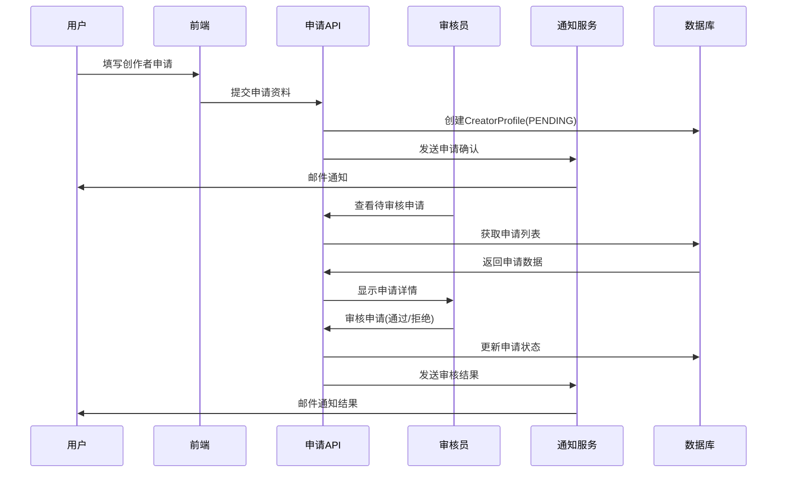
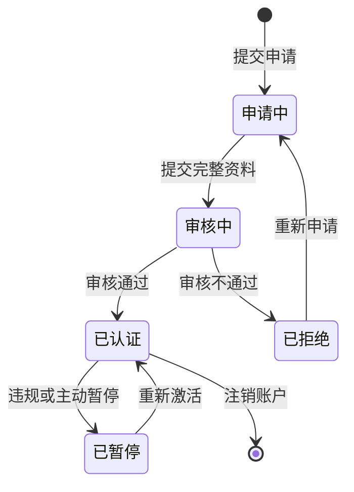

# 创作者平台

## 📋 概述

OpenAero 创作者平台是一个专为航空航天领域创作者设计的综合性平台，提供方案创作、发布、管理、收益查看等功能。平台支持完整的创作者生命周期，从申请认证到收益提现的全流程管理。

## 🏗️ 平台架构

### 创作者平台架构图

```mermaid
graph TB
    subgraph "创作者服务层"
        A[创作者申请] --> B[认证审核]
        B --> C[创作者中心]
        C --> D[方案管理]
        D --> E[收益管理]
    end
    
    subgraph "核心功能模块"
        F[方案编辑器] --> G[版本控制]
        G --> H[文件管理]
        H --> I[质量检测]
        I --> J[发布流程]
    end
    
    subgraph "收益系统"
        K[订单分成] --> L[收益统计]
        L --> M[提现管理]
        M --> N[财务报表]
    end
    
    subgraph "支持服务"
        O[数据分析] --> P[通知系统]
        P --> Q[客服支持]
        Q --> R[培训资源]
    end
```



## 🎭 创作者生命周期

### 申请流程



### 状态流转



## 📊 数据模型

### 核心表结构

#### 1. creator_profiles
```sql
CREATE TABLE creator_profiles (
    id UUID PRIMARY KEY DEFAULT gen_random_uuid(),
    user_id UUID NOT NULL REFERENCES auth.users(id) ON DELETE CASCADE,
    verification_status TEXT DEFAULT 'PENDING' CHECK (
        verification_status IN ('PENDING', 'APPROVED', 'REJECTED', 'SUSPENDED')
    ),
    verified_at TIMESTAMP WITH TIME ZONE,
    rejection_reason TEXT,
    specialties TEXT[], -- 专业领域：['结构设计', '动力系统', '航电系统']
    experience_years INTEGER DEFAULT 0,
    portfolio_urls TEXT[], -- 作品集链接
    social_links JSONB, -- 社交媒体链接
    bio TEXT, -- 个人简介
    company TEXT, -- 所属公司/机构
    job_title TEXT, -- 职位
    education JSONB, -- 教育背景
    certifications TEXT[], -- 认证证书
    awards TEXT[], -- 获奖情况
    revenue DECIMAL(12,2) DEFAULT 0, -- 累计收益
    rating DECIMAL(3,2) DEFAULT 0, -- 用户评分
    review_count INTEGER DEFAULT 0, -- 评价数量
    solution_count INTEGER DEFAULT 0, -- 方案数量
    follower_count INTEGER DEFAULT 0, -- 关注者数量
    is_featured BOOLEAN DEFAULT FALSE, -- 是否推荐创作者
    created_at TIMESTAMP WITH TIME ZONE DEFAULT NOW(),
    updated_at TIMESTAMP WITH TIME ZONE DEFAULT NOW(),
    
    UNIQUE(user_id)
);
```

#### 2. creator_applications (扩展申请信息)
```sql
CREATE TABLE creator_applications (
    id UUID PRIMARY KEY DEFAULT gen_random_uuid(),
    creator_profile_id UUID NOT NULL REFERENCES creator_profiles(id) ON DELETE CASCADE,
    application_data JSONB NOT NULL, -- 申请详细数据
    submitted_at TIMESTAMP WITH TIME ZONE DEFAULT NOW(),
    reviewed_at TIMESTAMP WITH TIME ZONE,
    reviewed_by UUID REFERENCES auth.users(id),
    review_notes TEXT,
    status TEXT DEFAULT 'PENDING' CHECK (
        status IN ('PENDING', 'APPROVED', 'REJECTED', 'REQUIRES_INFO')
    ),
    created_at TIMESTAMP WITH TIME ZONE DEFAULT NOW(),
    updated_at TIMESTAMP WITH TIME ZONE DEFAULT NOW()
);
```

#### 3. creator_statistics
```sql
CREATE TABLE creator_statistics (
    id UUID PRIMARY KEY DEFAULT gen_random_uuid(),
    creator_id UUID NOT NULL REFERENCES creator_profiles(id) ON DELETE CASCADE,
    date DATE NOT NULL,
    views INTEGER DEFAULT 0, -- 浏览量
    downloads INTEGER DEFAULT 0, -- 下载量
    orders INTEGER DEFAULT 0, -- 订单数
    revenue DECIMAL(12,2) DEFAULT 0, -- 当日收益
    new_followers INTEGER DEFAULT 0, -- 新增关注者
    created_at TIMESTAMP WITH TIME ZONE DEFAULT NOW(),
    
    UNIQUE(creator_id, date)
);
```

## 🚀 核心功能

### 1. 创作者申请

#### 申请表单数据结构
```typescript
interface CreatorApplicationData {
  // 基本信息
  bio: string;
  company?: string;
  jobTitle?: string;
  
  // 专业背景
  specialties: string[];
  experienceYears: number;
  education: {
    degree: string;
    major: string;
    school: string;
    year: number;
  }[];
  
  // 作品集
  portfolio: {
    title: string;
    description: string;
    url: string;
    images: string[];
  }[];
  
  // 社交媒体
  socialLinks: {
    linkedin?: string;
    github?: string;
    personal_website?: string;
    researchgate?: string;
  };
  
  // 证明文件
  documents: {
    type: 'certificate' | 'portfolio' | 'resume';
    url: string;
    name: string;
  }[];
}
```

#### 申请处理逻辑
```typescript
// src/lib/creator-application.ts
export async function processCreatorApplication(
  userId: string,
  applicationData: CreatorApplicationData
) {
  const supabase = createServerComponentClient<Database>({ cookies });
  
  // 1. 检查用户是否已申请
  const existingProfile = await supabase
    .from('creator_profiles')
    .select('*')
    .eq('user_id', userId)
    .single();
  
  if (existingProfile.data && existingProfile.data.verification_status !== 'REJECTED') {
    throw new Error('您已经提交过创作者申请');
  }
  
  // 2. 创建或更新创作者档案
  const { data: profile, error: profileError } = await supabase
    .from('creator_profiles')
    .upsert({
      user_id: userId,
      verification_status: 'PENDING',
      bio: applicationData.bio,
      company: applicationData.company,
      job_title: applicationData.jobTitle,
      specialties: applicationData.specialties,
      experience_years: applicationData.experienceYears,
      social_links: applicationData.socialLinks,
    })
    .select()
    .single();
  
  if (profileError) throw profileError;
  
  // 3. 保存详细申请信息
  const { error: applicationError } = await supabase
    .from('creator_applications')
    .insert({
      creator_profile_id: profile.id,
      application_data: applicationData,
    });
  
  if (applicationError) throw applicationError;
  
  // 4. 发送通知给管理员
  await notifyAdminsNewApplication(profile.id);
  
  return profile;
}
```

### 2. 方案管理

#### 创作者方案列表
```typescript
// src/app/api/creators/solutions/route.ts
export async function GET(request: NextRequest) {
  try {
    const user = await requireAuth();
    
    // 验证创作者身份
    const creatorProfile = await getCreatorProfile(user.id);
    if (!creatorProfile) {
      return NextResponse.json(
        { success: false, error: '您不是认证创作者' },
        { status: 403 }
      );
    }
    
    const { searchParams } = new URL(request.url);
    const page = parseInt(searchParams.get('page') || '1');
    const limit = parseInt(searchParams.get('limit') || '10');
    const status = searchParams.get('status');
    const category = searchParams.get('category');
    
    const supabase = createServerComponentClient<Database>({ cookies });
    
    let query = supabase
      .from('solutions')
      .select(`
        *,
        solution_categories(name),
        solution_versions(
          id,
          version,
          created_at
        ),
        _count {
          orders
        }
      `)
      .eq('creator_id', creatorProfile.id)
      .range((page - 1) * limit, page * limit - 1)
      .order('created_at', { ascending: false });
    
    if (status) {
      query = query.eq('status', status);
    }
    
    if (category) {
      query = query.eq('category_id', category);
    }
    
    const { data, error, count } = await query;
    
    if (error) throw error;
    
    return NextResponse.json({
      success: true,
      data: {
        solutions: data,
        pagination: {
          page,
          limit,
          total: count || 0,
          pages: Math.ceil((count || 0) / limit),
        },
      },
    });
  } catch (error) {
    return handleApiError(error);
  }
}
```

#### 方案发布流程
```typescript
// src/lib/solution-publishing.ts
export enum PublishStep {
  DRAFT = 'draft',
  REVIEW = 'review',
  APPROVED = 'approved',
  PUBLISHED = 'published',
  REJECTED = 'rejected',
}

export async function publishSolution(
  solutionId: string,
  creatorId: string
) {
  const supabase = createServerComponentClient<Database>({ cookies });
  
  // 1. 验证权限
  const solution = await supabase
    .from('solutions')
    .select('*')
    .eq('id', solutionId)
    .eq('creator_id', creatorId)
    .single();
  
  if (!solution.data) {
    throw new Error('方案不存在或无权限');
  }
  
  // 2. 质量检查
  const qualityCheck = await performQualityCheck(solutionId);
  if (!qualityCheck.passed) {
    throw new Error(`质量检查失败: ${qualityCheck.issues.join(', ')}`);
  }
  
  // 3. 更新状态为审核中
  await supabase
    .from('solutions')
    .update({
      status: 'REVIEW',
      submitted_for_review_at: new Date().toISOString(),
    })
    .eq('id', solutionId);
  
  // 4. 通知审核员
  await notifyReviewers(solutionId);
  
  // 5. 记录发布日志
  await logPublishAction(solutionId, creatorId, 'submit_for_review');
  
  return { success: true, message: '方案已提交审核' };
}

async function performQualityCheck(solutionId: string) {
  const supabase = createServerComponentClient<Database>({ cookies });
  
  const issues: string[] = [];
  
  // 检查基本信息
  const { data: solution } = await supabase
    .from('solutions')
    .select('title, description, category_id, price')
    .eq('id', solutionId)
    .single();
  
  if (!solution?.title) issues.push('标题不能为空');
  if (!solution?.description) issues.push('描述不能为空');
  if (!solution?.category_id) issues.push('必须选择分类');
  if (solution?.price <= 0) issues.push('价格必须大于0');
  
  // 检查文件
  const { data: files } = await supabase
    .from('solution_files')
    .select('type, url')
    .eq('solution_id', solutionId);
  
  const hasMainFile = files?.some(f => f.type === 'main');
  if (!hasMainFile) issues.push('必须上传主文件');
  
  // 检查图片
  const hasImages = files?.some(f => f.type === 'image');
  if (!hasImages) issues.push('建议上传预览图片');
  
  return {
    passed: issues.length === 0,
    issues,
  };
}
```

### 3. 收益管理

#### 收益分成计算
```typescript
// src/lib/revenue-calculator.ts
export interface RevenueShare {
  orderId: string;
  solutionId: string;
  solutionTitle: string;
  totalAmount: number;
  platformFee: number;
  creatorRevenue: number;
  status: 'pending' | 'available' | 'withdrawn';
  createdAt: Date;
  settledAt?: Date;
}

export async function calculateCreatorRevenue(
  creatorId: string,
  startDate?: Date,
  endDate?: Date
): Promise<{
  shares: RevenueShare[];
  totalRevenue: number;
  availableRevenue: number;
  withdrawnRevenue: number;
}> {
  const supabase = createServerComponentClient<Database>({ cookies });
  
  // 查询收益分成记录
  let query = supabase
    .from('revenue_shares')
    .select(`
      *,
      orders(id, order_number, created_at),
      solutions(id, title)
    `)
    .eq('creator_id', creatorId);
  
  if (startDate) {
    query = query.gte('created_at', startDate.toISOString());
  }
  
  if (endDate) {
    query = query.lte('created_at', endDate.toISOString());
  }
  
  const { data, error } = await query.order('created_at', { ascending: false });
  
  if (error) throw error;
  
  // 计算收益统计
  const shares: RevenueShare[] = data.map(share => ({
    orderId: share.order_id,
    solutionId: share.solution_id,
    solutionTitle: share.solutions?.title || '',
    totalAmount: Number(share.total_amount),
    platformFee: Number(share.platform_fee),
    creatorRevenue: Number(share.creator_revenue),
    status: share.status as RevenueShare['status'],
    createdAt: new Date(share.created_at),
    settledAt: share.settled_at ? new Date(share.settled_at) : undefined,
  }));
  
  const totalRevenue = shares.reduce((sum, share) => sum + share.creatorRevenue, 0);
  const availableRevenue = shares
    .filter(share => share.status === 'available')
    .reduce((sum, share) => sum + share.creatorRevenue, 0);
  const withdrawnRevenue = shares
    .filter(share => share.status === 'withdrawn')
    .reduce((sum, share) => sum + share.creatorRevenue, 0);
  
  return {
    shares,
    totalRevenue,
    availableRevenue,
    withdrawnRevenue,
  };
}
```

#### 提现申请
```typescript
// src/app/api/revenue/withdraw/route.ts
export async function POST(request: NextRequest) {
  try {
    const user = await requireAuth();
    const { amount, withdrawMethod, withdrawAccount } = await request.json();
    
    // 验证创作者身份
    const creatorProfile = await getCreatorProfile(user.id);
    if (!creatorProfile) {
      return NextResponse.json(
        { success: false, error: '您不是认证创作者' },
        { status: 403 }
      );
    }
    
    // 验证提现金额
    if (amount < 100) {
      return NextResponse.json(
        { success: false, error: '最低提现金额为 100 元' },
        { status: 400 }
      );
    }
    
    const supabase = createServerComponentClient<Database>({ cookies });
    
    // 检查可用余额
    const { data: availableRevenue } = await supabase
      .from('revenue_shares')
      .select('creator_revenue')
      .eq('creator_id', creatorProfile.id)
      .eq('status', 'available');
    
    const totalAvailable = availableRevenue?.reduce(
      (sum, share) => sum + Number(share.creator_revenue), 
      0
    ) || 0;
    
    if (amount > totalAvailable) {
      return NextResponse.json(
        { success: false, error: '提现金额超过可用余额' },
        { status: 400 }
      );
    }
    
    // 创建提现记录
    const { data: withdraw, error } = await supabase
      .from('withdrawals')
      .insert({
        creator_id: creatorProfile.id,
        amount,
        withdraw_method: withdrawMethod,
        withdraw_account: withdrawAccount,
        status: 'pending',
      })
      .select()
      .single();
    
    if (error) throw error;
    
    // 更新收益分成状态
    const sharesToUpdate = availableRevenue
      .sort((a, b) => Number(a.creator_revenue) - Number(b.creator_revenue))
      .reduce((acc, share) => {
        if (acc.remainingAmount <= 0) return acc;
        
        const updateAmount = Math.min(
          Number(share.creator_revenue),
          acc.remainingAmount
        );
        
        acc.updates.push({
          id: share.id,
          amount: updateAmount,
        });
        
        acc.remainingAmount -= updateAmount;
        return acc;
      }, { remainingAmount: amount, updates: [] as any[] });
    
    // 批量更新收益分成状态
    if (sharesToUpdate.updates.length > 0) {
      await Promise.all(
        sharesToUpdate.updates.map(update =>
          supabase
            .from('revenue_shares')
            .update({
              status: 'withdrawn',
              withdrawn_at: new Date().toISOString(),
              withdraw_id: withdraw.id,
            })
            .eq('id', update.id)
        )
      );
    }
    
    // 通知管理员
    await notifyAdminsWithdrawal(withdraw.id);
    
    return NextResponse.json({
      success: true,
      data: withdraw,
    });
  } catch (error) {
    return handleApiError(error);
  }
}
```

### 4. 数据分析

#### 创作者数据看板
```typescript
// src/lib/creator-analytics.ts
export interface CreatorAnalytics {
  overview: {
    totalSolutions: number;
    totalOrders: number;
    totalRevenue: number;
    averageRating: number;
    followerCount: number;
  };
  trends: {
    dailyViews: { date: string; views: number }[];
    dailyOrders: { date: string; orders: number }[];
    dailyRevenue: { date: string; revenue: number }[];
  };
  topSolutions: {
    id: string;
    title: string;
    orders: number;
    revenue: number;
    rating: number;
  }[];
  audience: {
    byCountry: { country: string; count: number }[];
    byDevice: { device: string; count: number }[];
    bySource: { source: string; count: number }[];
  };
}

export async function getCreatorAnalytics(
  creatorId: string,
  dateRange: { start: Date; end: Date }
): Promise<CreatorAnalytics> {
  const supabase = createServerComponentClient<Database>({ cookies });
  
  // 获取概览数据
  const [
    solutionCount,
    orderStats,
    revenueStats,
    ratingStats,
    creatorProfile,
  ] = await Promise.all([
    // 方案总数
    supabase
      .from('solutions')
      .select('id', { count: 'exact' })
      .eq('creator_id', creatorId),
    
    // 订单统计
    supabase
      .from('orders')
      .select('total_amount', { count: 'exact' })
      .eq('creator_id', creatorId),
    
    // 收益统计
    supabase
      .from('revenue_shares')
      .select('creator_revenue', { count: 'exact' })
      .eq('creator_id', creatorId),
    
    // 评分统计
    supabase
      .from('solution_reviews')
      .select('rating')
      .eq('solution.creator_id', creatorId),
    
    // 创作者档案
    supabase
      .from('creator_profiles')
      .select('follower_count, rating')
      .eq('id', creatorId)
      .single(),
  ]);
  
  // 获取趋势数据
  const [viewTrends, orderTrends, revenueTrends] = await Promise.all([
    // 浏览趋势
    supabase
      .from('creator_statistics')
      .select('date, views')
      .eq('creator_id', creatorId)
      .gte('date', dateRange.start.toISOString().slice(0, 10))
      .lte('date', dateRange.end.toISOString().slice(0, 10))
      .order('date'),
    
    // 订单趋势
    supabase
      .from('creator_statistics')
      .select('date, orders')
      .eq('creator_id', creatorId)
      .gte('date', dateRange.start.toISOString().slice(0, 10))
      .lte('date', dateRange.end.toISOString().slice(0, 10))
      .order('date'),
    
    // 收益趋势
    supabase
      .from('creator_statistics')
      .select('date, revenue')
      .eq('creator_id', creatorId)
      .gte('date', dateRange.start.toISOString().slice(0, 10))
      .lte('date', dateRange.end.toISOString().slice(0, 10))
      .order('date'),
  ]);
  
  // 获取热门方案
  const { data: topSolutions } = await supabase
    .from('solutions')
    .select(`
      id,
      title,
      orders!inner(count),
      revenue_shares!inner(creator_revenue),
      solution_reviews(rating)
    `)
    .eq('creator_id', creatorId)
    .order('orders.count', { ascending: false })
    .limit(5);
  
  return {
    overview: {
      totalSolutions: solutionCount.count || 0,
      totalOrders: orderStats.count || 0,
      totalRevenue: revenueStats.data?.reduce((sum, r) => sum + Number(r.creator_revenue), 0) || 0,
      averageRating: creatorProfile.data?.rating || 0,
      followerCount: creatorProfile.data?.follower_count || 0,
    },
    trends: {
      dailyViews: viewTrends.data?.map(d => ({
        date: d.date,
        views: d.views,
      })) || [],
      dailyOrders: orderTrends.data?.map(d => ({
        date: d.date,
        orders: d.orders,
      })) || [],
      dailyRevenue: revenueTrends.data?.map(d => ({
        date: d.date,
        revenue: Number(d.revenue),
      })) || [],
    },
    topSolutions: topSolutions?.map(solution => ({
      id: solution.id,
      title: solution.title,
      orders: solution.orders?.count || 0,
      revenue: solution.revenue_shares?.reduce((sum, r) => sum + Number(r.creator_revenue), 0) || 0,
      rating: solution.solution_reviews?.reduce((sum, r) => sum + r.rating, 0) / solution.solution_reviews?.length || 0,
    })) || [],
    audience: {
      byCountry: [], // 需要实现地理位置统计
      byDevice: [], // 需要实现设备统计
      bySource: [], // 需要实现来源统计
    },
  };
}
```

## 🎯 创作者中心功能

### 1. 仪表板
- 实时数据展示
- 收益趋势图表
- 方案表现分析
- 通知中心

### 2. 方案管理
- 方案创建和编辑
- 版本控制
- 文件管理
- 发布状态跟踪

### 3. 收益管理
- 收益明细
- 提现申请
- 财务报表
- 税务信息

### 4. 个人品牌
- 个人资料编辑
- 作品集展示
- 社交媒体链接
- 关注者管理

## 📱 移动端支持

### 创作者移动应用功能
```typescript
// 移动端特有的功能
interface MobileCreatorFeatures {
  // 快速发布
  quickPublish: {
    capturePhoto: boolean;
    voiceDescription: boolean;
    templateBased: boolean;
  };
  
  // 消息通知
  notifications: {
    pushNotifications: boolean;
    emailDigest: boolean;
    smsAlerts: boolean;
  };
  
  // 离线功能
  offlineMode: {
    draftSync: boolean;
    cachedContent: boolean;
    offlineAnalytics: boolean;
  };
}
```

## 🔧 API 接口

### 创作者相关 API

#### 1. 申请创作者
```typescript
// POST /api/creators/apply
export async function POST(request: NextRequest) {
  // 实现创作者申请逻辑
}
```

#### 2. 获取创作者数据
```typescript
// GET /api/creators/me
export async function GET(request: NextRequest) {
  // 返回创作者档案和统计数据
}
```

#### 3. 更新创作者资料
```typescript
// PUT /api/creators/me
export async function PUT(request: NextRequest) {
  // 更新创作者信息
}
```

#### 4. 获取收益数据
```typescript
// GET /api/creators/revenue
export async function GET(request: NextRequest) {
  // 返回收益统计和明细
}
```

## 📈 性能优化

### 1. 数据库优化
```sql
-- 创作者相关索引
CREATE INDEX idx_creator_profiles_user_id ON creator_profiles(user_id);
CREATE INDEX idx_creator_profiles_status ON creator_profiles(verification_status);
CREATE INDEX idx_solutions_creator_id ON solutions(creator_id);
CREATE INDEX idx_revenue_shares_creator_id ON revenue_shares(creator_id);
CREATE INDEX idx_creator_statistics_creator_date ON creator_statistics(creator_id, date);
```

### 2. 缓存策略
```typescript
// 创作者数据缓存
export class CreatorCache {
  private cache = new Map<string, { data: any; expiry: number }>();
  
  async getCreatorProfile(creatorId: string) {
    const cached = this.cache.get(`profile:${creatorId}`);
    if (cached && cached.expiry > Date.now()) {
      return cached.data;
    }
    
    const data = await fetchCreatorProfile(creatorId);
    this.cache.set(`profile:${creatorId}`, {
      data,
      expiry: Date.now() + 5 * 60 * 1000, // 5分钟
    });
    
    return data;
  }
}
```

## 🛡️ 安全考虑

### 1. 数据保护
- 创作者个人信息加密
- 收益数据访问控制
- 文件上传安全验证

### 2. 防刷机制
```typescript
// 防刷限制
export class CreatorRateLimit {
  private limits = {
    publish: { max: 5, window: 3600000 }, // 每小时最多发布5个方案
    withdraw: { max: 3, window: 86400000 }, // 每天最多3次提现
    update: { max: 50, window: 3600000 }, // 每小时最多50次更新
  };
  
  async checkLimit(creatorId: string, action: string): Promise<boolean> {
    const limit = this.limits[action];
    if (!limit) return true;
    
    // 实现限制检查逻辑
    return true;
  }
}
```

## 📊 监控和分析

### 1. 关键指标
- 创作者注册数量
- 方案发布数量
- 收益分成总额
- 用户满意度评分

### 2. 异常监控
```typescript
// 创作者平台异常监控
export class CreatorMonitoring {
  async trackMetrics() {
    const metrics = {
      activeCreators: await this.getActiveCreatorCount(),
      dailySubmissions: await this.getDailySubmissionCount(),
      averageRevenue: await this.getAverageCreatorRevenue(),
      conversionRate: await this.getApplicationConversionRate(),
    };
    
    // 发送到监控系统
    await this.sendMetrics(metrics);
  }
}
```

## 🎓 创作者支持

### 1. 培训资源
- 创作者指南
- 最佳实践教程
- 视频教程
- FAQ 文档

### 2. 社区建设
- 创作者论坛
- 经验分享
- 合作机会
- 线下活动

---

## 📚 相关文档

- [方案管理工作流程](./SOLUTION_WORKFLOW.md) - 方案创建和管理流程
- [订单支付系统](./ORDER_PAYMENT_SYSTEM.md) - 订单和收益分成机制
- [用户管理系统](./USER_MANAGEMENT.md) - 用户认证和权限管理
- [API 文档](./API_DOCUMENTATION.md) - 完整的 API 接口文档

---

*最后更新: 2025-01-16*