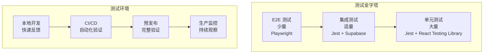

# 测试指南

## 📋 概述

OpenAero 项目采用多层次的测试策略，包括单元测试、集成测试和端到端测试，确保代码质量和系统稳定性。本指南详细说明了测试框架、最佳实践和具体实施方法。

## 🏗️ 测试架构

### 测试金字塔



## 🛠️ 测试技术栈

### 核心框架

| 技术 | 用途 | 版本 | 配置文件 |
|------|------|------|----------|
| **Jest** | 单元测试、集成测试框架 | ^29.7.0 | `jest.config.js` |
| **React Testing Library** | React 组件测试 | ^14.1.2 | - |
| **Playwright** | E2E 测试 | ^1.40.0 | `playwright.config.ts` |
| **Supabase Test Helpers** | 数据库测试工具 | 自定义 | `tests/setup/` |
| **MSW** | API 模拟 | ^2.0.0 | `tests/mocks/` |

### 测试工具

```json
{
  "scripts": {
    "test": "jest",
    "test:watch": "jest --watch",
    "test:coverage": "jest --coverage",
    "test:ci": "jest --ci --coverage --watchAll=false",
    "test:e2e": "playwright test",
    "test:e2e:ui": "playwright test --ui",
    "test:all": "npm run test:ci && npm run test:e2e"
  },
  "devDependencies": {
    "@testing-library/jest-dom": "^6.1.0",
    "@testing-library/react": "^14.1.0",
    "@testing-library/user-event": "^14.5.0",
    "jest-environment-jsdom": "^29.7.0",
    "msw": "^2.0.0",
    "@playwright/test": "^1.40.0"
  }
}
```

## ⚙️ 测试配置

### Jest 配置

```javascript
// jest.config.js
const nextJest = require('next/jest');

const createJestConfig = nextJest({
  dir: './',
});

const customJestConfig = {
  setupFilesAfterEnv: ['<rootDir>/jest.setup.js'],
  testEnvironment: 'jsdom',
  testPathIgnorePatterns: [
    '<rootDir>/.next/',
    '<rootDir>/node_modules/',
    '<rootDir>/dist/',
    '<rootDir>/build/',
    '<rootDir>/out/',
  ],
  moduleNameMapper: {
    '^@/(.*)$': '<rootDir>/src/$1',
    '^@/components/(.*)$': '<rootDir>/src/components/$1',
    '^@/lib/(.*)$': '<rootDir>/src/lib/$1',
    '^@/hooks/(.*)$': '<rootDir>/src/hooks/$1',
    '^@/types/(.*)$': '<rootDir>/src/types/$1',
    '\\.(css|less|scss|sass)$': 'identity-obj-proxy',
  },
  collectCoverageFrom: [
    'src/**/*.{js,jsx,ts,tsx}',
    '!src/**/*.d.ts',
    '!src/**/*.stories.{js,jsx,ts,tsx}',
    '!src/**/*.test.{js,jsx,ts,tsx}',
    '!src/**/*.spec.{js,jsx,ts,tsx}',
    '!src/**/index.{js,jsx,ts,tsx}',
    '!src/app/layout.tsx',
    '!src/app/globals.css',
    '!src/i18n.ts',
    '!src/instrumentation.ts',
    '!src/middleware.ts',
  ],
  coverageThreshold: {
    global: {
      branches: 85,
      functions: 85,
      lines: 85,
      statements: 85,
    },
    './src/components/': {
      branches: 90,
      functions: 90,
      lines: 90,
      statements: 90,
    },
    './src/lib/': {
      branches: 80,
      functions: 80,
      lines: 80,
      statements: 80,
    },
  },
  testMatch: [
    '<rootDir>/src/**/__tests__/**/*.{js,jsx,ts,tsx}',
    '<rootDir>/src/**/*.{test,spec}.{js,jsx,ts,tsx}',
    '<rootDir>/tests/**/*.{test,spec}.{js,jsx,ts,tsx}',
  ],
  coverageReporters: ['text', 'lcov', 'html', 'json-summary', 'clover'],
  coverageDirectory: 'coverage',
  verbose: true,
  bail: 1,
  errorOnDeprecated: true,
  maxWorkers: '50%',
  testTimeout: 10000,
};
```

### Playwright 配置

```typescript
// playwright.config.ts
import { defineConfig, devices } from '@playwright/test';

export default defineConfig({
  testDir: './tests/e2e',
  fullyParallel: true,
  forbidOnly: !!process.env.CI,
  retries: process.env.CI ? 2 : 0,
  workers: process.env.CI ? 1 : undefined,
  reporter: [
    ['html', { outputFolder: 'playwright-report' }],
    ['json', { outputFile: 'test-results.json' }],
    ['junit', { outputFile: 'test-results.xml' }],
  ],
  use: {
    baseURL: process.env.BASE_URL || 'http://localhost:3000',
    trace: 'on-first-retry',
    screenshot: 'only-on-failure',
    video: 'retain-on-failure',
  },
  projects: [
    {
      name: 'chromium',
      use: { ...devices['Desktop Chrome'] },
    },
    {
      name: 'firefox',
      use: { ...devices['Desktop Firefox'] },
    },
    {
      name: 'webkit',
      use: { ...devices['Desktop Safari'] },
    },
    {
      name: 'Mobile Chrome',
      use: { ...devices['Pixel 5'] },
    },
    {
      name: 'Mobile Safari',
      use: { ...devices['iPhone 12'] },
    },
  ],
  webServer: {
    command: 'npm run dev:3000',
    url: 'http://localhost:3000',
    reuseExistingServer: !process.env.CI,
    timeout: 120 * 1000,
  },
});
```

## 🧪 单元测试

### 测试结构

```
src/
├── components/
│   └── __tests__/
│       ├── Button.test.tsx
│       ├── Form.test.tsx
│       └── Layout.test.tsx
├── lib/
│   └── __tests__/
│       ├── auth.test.ts
│       ├── api.test.ts
│       └── utils.test.ts
└── hooks/
    └── __tests__/
        ├── useAuth.test.ts
        └── useApi.test.ts
```

### 组件测试示例

```typescript
// src/components/__tests__/Button.test.tsx
import React from 'react';
import { render, screen, fireEvent } from '@testing-library/react';
import { Button } from '../Button';

describe('Button Component', () => {
  it('renders correctly with text', () => {
    render(<Button>Click me</Button>);
    expect(screen.getByRole('button', { name: /click me/i })).toBeInTheDocument();
  });

  it('handles click events', () => {
    const handleClick = jest.fn();
    render(<Button onClick={handleClick}>Click me</Button>);
    
    fireEvent.click(screen.getByRole('button'));
    expect(handleClick).toHaveBeenCalledTimes(1);
  });

  it('applies correct styles for variants', () => {
    render(<Button variant="primary">Primary Button</Button>);
    const button = screen.getByRole('button');
    
    expect(button).toHaveClass('bg-blue-600');
  });

  it('is disabled when loading', () => {
    render(<Button loading>Loading</Button>);
    const button = screen.getByRole('button');
    
    expect(button).toBeDisabled();
    expect(button).toHaveAttribute('aria-busy', 'true');
  });
});
```

### Hook 测试示例

```typescript
// src/hooks/__tests__/useAuth.test.ts
import { renderHook, act } from '@testing-library/react';
import { useAuth } from '../useAuth';
import { createWrapper } from '../../../tests/utils/test-utils';

describe('useAuth Hook', () => {
  it('returns initial auth state', () => {
    const { result } = renderHook(() => useAuth(), {
      wrapper: createWrapper(),
    });

    expect(result.current.user).toBeNull();
    expect(result.current.loading).toBe(true);
  });

  it('handles login successfully', async () => {
    const { result } = renderHook(() => useAuth(), {
      wrapper: createWrapper(),
    });

    await act(async () => {
      await result.current.login('test@example.com', 'password');
    });

    expect(result.current.user).toBeTruthy();
    expect(result.current.loading).toBe(false);
  });

  it('handles login errors', async () => {
    const { result } = renderHook(() => useAuth(), {
      wrapper: createWrapper(),
    });

    await act(async () => {
      await expect(
        result.current.login('invalid@example.com', 'wrong-password')
      ).rejects.toThrow('Invalid credentials');
    });

    expect(result.current.error).toBeTruthy();
  });
});
```

### API 测试示例

```typescript
// src/lib/__tests__/api.test.ts
import { createSupabaseClient } from '../supabase-client';

// Mock Supabase
jest.mock('@supabase/supabase-js', () => ({
  createClient: jest.fn(() => ({
    auth: {
      signInWithPassword: jest.fn(),
      signUp: jest.fn(),
      signOut: jest.fn(),
    },
    from: jest.fn(() => ({
      select: jest.fn().mockReturnThis(),
      eq: jest.fn().mockReturnThis(),
      single: jest.fn(),
      insert: jest.fn().mockReturnThis(),
      update: jest.fn().mockReturnThis(),
    })),
  })),
}));

describe('API Functions', () => {
  beforeEach(() => {
    jest.clearAllMocks();
  });

  describe('createUser', () => {
    it('creates user successfully', async () => {
      const mockUser = { id: '123', email: 'test@example.com' };
      const supabase = createSupabaseClient();
      
      supabase.auth.signUp.mockResolvedValue({
        data: { user: mockUser },
        error: null,
      });

      const result = await createUser('test@example.com', 'password');
      
      expect(result).toEqual(mockUser);
      expect(supabase.auth.signUp).toHaveBeenCalledWith({
        email: 'test@example.com',
        password: 'password',
      });
    });

    it('handles sign up errors', async () => {
      const supabase = createSupabaseClient();
      
      supabase.auth.signUp.mockResolvedValue({
        data: null,
        error: { message: 'Email already exists' },
      });

      await expect(
        createUser('existing@example.com', 'password')
      ).rejects.toThrow('Email already exists');
    });
  });
});
```

## 🔄 集成测试

### 数据库集成测试

```typescript
// tests/integration/auth.test.ts
import { createTestClient, setupTestDatabase, cleanupTestDatabase } from '../helpers';

describe('Authentication Integration Tests', () => {
  let supabase: any;

  beforeAll(async () => {
    supabase = await setupTestDatabase();
  });

  afterAll(async () => {
    await cleanupTestDatabase();
  });

  beforeEach(async () => {
    // 清理测试数据
    await supabase.from('user_profiles').delete().neq('id', '');
  });

  describe('User Registration Flow', () => {
    it('completes full registration flow', async () => {
      // 1. 注册用户
      const { data: authData, error: authError } = await supabase.auth.signUp({
        email: 'test@example.com',
        password: 'password123',
      });

      expect(authError).toBeNull();
      expect(authData.user).toBeTruthy();

      // 2. 创建用户档案
      const { data: profile, error: profileError } = await supabase
        .from('user_profiles')
        .insert({
          user_id: authData.user.id,
          first_name: 'Test',
          last_name: 'User',
          role: 'USER',
        })
        .select()
        .single();

      expect(profileError).toBeNull();
      expect(profile.first_name).toBe('Test');

      // 3. 验证邮箱
      const { error: verifyError } = await supabase.auth.admin.updateUserById(
        authData.user.id,
        { email_confirm: true }
      );

      expect(verifyError).toBeNull();

      // 4. 验证用户状态
      const { data: updatedProfile } = await supabase
        .from('user_profiles')
        .select('*, auth_user:auth.users(email_confirmed)')
        .eq('user_id', authData.user.id)
        .single();

      expect(updatedProfile.auth_user.email_confirmed).toBe(true);
    });
  });
});
```

### API 路由集成测试

```typescript
// tests/integration/api.test.ts
import { createTestApp } from '../helpers';
import request from 'supertest';

describe('API Integration Tests', () => {
  let app: any;

  beforeAll(async () => {
    app = await createTestApp();
  });

  describe('POST /api/auth/login', () => {
    it('authenticates user with valid credentials', async () => {
      const response = await request(app)
        .post('/api/auth/login')
        .send({
          email: 'test@example.com',
          password: 'password123',
        })
        .expect(200);

      expect(response.body.success).toBe(true);
      expect(response.body.data.user).toBeTruthy();
      expect(response.body.data.session).toBeTruthy();
    });

    it('rejects invalid credentials', async () => {
      const response = await request(app)
        .post('/api/auth/login')
        .send({
          email: 'test@example.com',
          password: 'wrongpassword',
        })
        .expect(401);

      expect(response.body.success).toBe(false);
      expect(response.body.error).toContain('Invalid credentials');
    });
  });

  describe('GET /api/solutions', () => {
    it('returns paginated solutions', async () => {
      const response = await request(app)
        .get('/api/solutions')
        .query({ page: 1, limit: 10 })
        .expect(200);

      expect(response.body.success).toBe(true);
      expect(response.body.data.solutions).toBeInstanceOf(Array);
      expect(response.body.data.pagination).toBeTruthy();
    });
  });
});
```

## 🌐 端到端测试

### Playwright E2E 测试

```typescript
// tests/e2e/auth.spec.ts
import { test, expect } from '@playwright/test';

test.describe('Authentication', () => {
  test.beforeEach(async ({ page }) => {
    await page.goto('/');
  });

  test('user can register and login', async ({ page }) => {
    // 注册新用户
    await page.click('text=注册');
    await page.fill('[data-testid="email-input"]', 'test@example.com');
    await page.fill('[data-testid="password-input"]', 'password123');
    await page.fill('[data-testid="confirm-password-input"]', 'password123');
    await page.click('[data-testid="register-button"]');

    // 验证注册成功
    await expect(page.locator('text=注册成功')).toBeVisible();
    await expect(page).toHaveURL('/auth/verify-email');

    // 模拟邮箱验证
    await page.goto('/api/test/verify-email?email=test@example.com');

    // 登录
    await page.goto('/auth/login');
    await page.fill('[data-testid="email-input"]', 'test@example.com');
    await page.fill('[data-testid="password-input"]', 'password123');
    await page.click('[data-testid="login-button"]');

    // 验证登录成功
    await expect(page).toHaveURL('/dashboard');
    await expect(page.locator('text=欢迎回来')).toBeVisible();
  });

  test('user cannot login with invalid credentials', async ({ page }) => {
    await page.goto('/auth/login');
    await page.fill('[data-testid="email-input"]', 'invalid@example.com');
    await page.fill('[data-testid="password-input"]', 'wrongpassword');
    await page.click('[data-testid="login-button"]');

    await expect(page.locator('text=邮箱或密码错误')).toBeVisible();
    await expect(page).toHaveURL('/auth/login');
  });
});
```

### 方案管理 E2E 测试

```typescript
// tests/e2e/solution-management.spec.ts
import { test, expect } from '@playwright/test';

test.describe('Solution Management', () => {
  test.beforeEach(async ({ page }) => {
    // 登录为创作者
    await loginAsCreator(page);
  });

  test('creator can create and publish solution', async ({ page }) => {
    // 创建新方案
    await page.goto('/creator/solutions/new');
    await page.fill('[data-testid="solution-title"]', '测试方案');
    await page.fill('[data-testid="solution-description"]', '这是一个测试方案');
    await page.selectOption('[data-testid="solution-category"]', '结构设计');
    await page.fill('[data-testid="solution-price"]', '99');

    // 上传文件
    await page.setInputFiles('[data-testid="file-upload"]', 'tests/fixtures/test-file.pdf');
    await expect(page.locator('text=test-file.pdf')).toBeVisible();

    // 保存草稿
    await page.click('[data-testid="save-draft"]');
    await expect(page.locator('text=草稿已保存')).toBeVisible();

    // 提交审核
    await page.click('[data-testid="submit-review"]');
    await expect(page.locator('text=方案已提交审核')).toBeVisible();

    // 验证方案状态
    await page.goto('/creator/solutions');
    await expect(page.locator('text=测试方案')).toBeVisible();
    await expect(page.locator('text=审核中')).toBeVisible();
  });

  test('creator can edit existing solution', async ({ page }) => {
    // 导航到现有方案
    await page.goto('/creator/solutions');
    await page.click('text=编辑方案');

    // 修改内容
    await page.fill('[data-testid="solution-title"]', '更新后的方案标题');
    await page.click('[data-testid="save-changes"]');

    // 验证更新成功
    await expect(page.locator('text=方案已更新')).toBeVisible();
    await expect(page.locator('[data-testid="solution-title"]')).toHaveValue('更新后的方案标题');
  });
});

async function loginAsCreator(page: any) {
  await page.goto('/auth/login');
  await page.fill('[data-testid="email-input"]', 'creator@example.com');
  await page.fill('[data-testid="password-input"]', 'password123');
  await page.click('[data-testid="login-button"]');
  await expect(page).toHaveURL('/creator/dashboard');
}
```

## 🎯 测试最佳实践

### 1. 测试命名规范

```typescript
// ✅ 好的测试命名
describe('UserService', () => {
  it('should create user with valid data', () => {});
  it('should throw error when email already exists', () => {});
  it('should hash password before saving', () => {});
});

// ❌ 避免的测试命名
describe('UserService', () => {
  it('test1', () => {});
  it('create user', () => {});
  it('works', () => {});
});
```

### 2. 测试结构模式 (AAA)

```typescript
// Arrange - 准备测试数据
const userData = {
  email: 'test@example.com',
  password: 'password123',
};

// Act - 执行被测试的操作
const result = await createUser(userData);

// Assert - 验证结果
expect(result.email).toBe(userData.email);
expect(result.password).not.toBe(userData.password); // 密码应该被哈希
```

### 3. 测试数据工厂

```typescript
// tests/factories/user-factory.ts
import { faker } from '@faker-js/faker';

export class UserFactory {
  static create(overrides: Partial<any> = {}) {
    return {
      id: faker.string.uuid(),
      email: faker.internet.email(),
      firstName: faker.person.firstName(),
      lastName: faker.person.lastName(),
      role: 'USER',
      isActive: true,
      createdAt: new Date(),
      ...overrides,
    };
  }

  static createMany(count: number, overrides: Partial<any> = {}) {
    return Array.from({ length: count }, () => this.create(overrides));
  }
}
```

### 4. Mock 和 Stub 策略

```typescript
// 测试中的 Mock 使用
import { jest } from '@jest/globals';

// Mock 外部依赖
jest.mock('@supabase/supabase-js', () => ({
  createClient: jest.fn(() => mockSupabase),
}));

// Mock API 响应
const mockSupabase = {
  from: jest.fn(() => ({
    select: jest.fn().mockReturnThis(),
    eq: jest.fn().mockReturnThis(),
    single: jest.fn().mockResolvedValue({
      data: UserFactory.create(),
      error: null,
    }),
  })),
};

// Spy 方法调用
const spy = jest.spyOn(userService, 'createUser');
spy.mockResolvedValue(mockUser);
```

## 📊 测试覆盖率

### 覆盖率配置

```javascript
// jest.config.js 中的覆盖率配置
coverageThreshold: {
  global: {
    branches: 85,
    functions: 85,
    lines: 85,
    statements: 85,
  },
  './src/components/': {
    branches: 90,
    functions: 90,
    lines: 90,
    statements: 90,
  },
  './src/lib/': {
    branches: 80,
    functions: 80,
    lines: 80,
    statements: 80,
  },
},
```

### 覆盖率报告

```bash
# 生成覆盖率报告
npm run test:coverage

# 查看详细报告
open coverage/lcov-report/index.html

# 覆盖率阈值检查
npm run test:ci
```

## 🔧 测试工具和辅助函数

### 测试工具类

```typescript
// tests/utils/test-utils.ts
import { ReactElement } from 'react';
import { render, RenderOptions } from '@testing-library/react';
import { QueryClient, QueryClientProvider } from '@tanstack/react-query';

// 创建测试用的 QueryClient
export const createTestQueryClient = () => {
  return new QueryClient({
    defaultOptions: {
      queries: {
        retry: false,
        gcTime: 0,
      },
    },
  });
};

// 测试 Wrapper
export const createWrapper = () => {
  const queryClient = createTestQueryClient();
  
  return ({ children }: { children: React.ReactNode }) => (
    <QueryClientProvider client={queryClient}>
      {children}
    </QueryClientProvider>
  );
};

// 自定义 render 函数
export const renderWithProviders = (
  ui: ReactElement,
  options?: Omit<RenderOptions, 'wrapper'>
) => {
  return render(ui, { wrapper: createWrapper(), ...options });
};
```

### 测试数据清理

```typescript
// tests/helpers/database.ts
import { createClient } from '@supabase/supabase-js';

const supabase = createClient(
  process.env.NEXT_PUBLIC_SUPABASE_URL!,
  process.env.SUPABASE_SERVICE_ROLE_KEY!
);

export const setupTestDatabase = async () => {
  // 创建测试数据
  const testUser = await supabase.auth.admin.createUser({
    email: 'test@example.com',
    password: 'password123',
    email_confirm: true,
  });

  return supabase;
};

export const cleanupTestDatabase = async () => {
  // 清理测试数据
  await supabase.from('user_profiles').delete().like('email', '%@test.com');
  await supabase.auth.admin.deleteUser('test@example.com');
};

export const createTestData = async (tableName: string, data: any) => {
  const { data: result, error } = await supabase
    .from(tableName)
    .insert(data)
    .select()
    .single();

  if (error) throw error;
  return result;
};
```

## 🚀 CI/CD 集成

### GitHub Actions 工作流

```yaml
# .github/workflows/test.yml
name: Tests

on:
  push:
    branches: [ main, develop ]
  pull_request:
    branches: [ main ]

jobs:
  unit-tests:
    runs-on: ubuntu-latest
    
    steps:
    - name: Checkout code
      uses: actions/checkout@v4

    - name: Setup Node.js
      uses: actions/setup-node@v4
      with:
        node-version: '18'
        cache: 'npm'

    - name: Install dependencies
      run: npm ci

    - name: Run unit tests
      run: npm run test:ci
      env:
        CI: true

    - name: Upload coverage reports
      uses: codecov/codecov-action@v3
      with:
        file: ./coverage/lcov.info

  e2e-tests:
    runs-on: ubuntu-latest
    
    steps:
    - name: Checkout code
      uses: actions/checkout@v4

    - name: Setup Node.js
      uses: actions/setup-node@v4
      with:
        node-version: '18'
        cache: 'npm'

    - name: Install dependencies
      run: npm ci

    - name: Install Playwright browsers
      run: npx playwright install --with-deps

    - name: Run E2E tests
      run: npm run test:e2e
      env:
        BASE_URL: http://localhost:3000

    - name: Upload test results
      uses: actions/upload-artifact@v3
      if: failure()
      with:
        name: playwright-report
        path: playwright-report/
```

## 📈 性能测试

### 负载测试

```typescript
// tests/performance/load-test.ts
import { loadTest } from 'k6';
import http from 'k6/http';

export const options = {
  stages: [
    { duration: '2m', target: 100 }, // 2分钟内增加到100用户
    { duration: '5m', target: 100 }, // 保持100用户5分钟
    { duration: '2m', target: 200 }, // 2分钟内增加到200用户
    { duration: '5m', target: 200 }, // 保持200用户5分钟
    { duration: '2m', target: 0 },    // 2分钟内减少到0用户
  ],
};

export default function () {
  const response = http.get('https://api.openaero.com/solutions');
  
  check(response, {
    'status is 200': (r) => r.status === 200,
    'response time < 500ms': (r) => r.timings.duration < 500,
  });
}
```

### 组件性能测试

```typescript
// src/components/__tests__/performance.test.tsx
import { render } from '@testing-library/react';
import { PerformanceObserver } from 'perf_hooks';

describe('Component Performance', () => {
  it('renders large list efficiently', () => {
    const startTime = performance.now();
    
    const { container } = render(<LargeListComponent items={Array(1000)} />);
    
    const endTime = performance.now();
    const renderTime = endTime - startTime;
    
    // 渲染时间应该小于100ms
    expect(renderTime).toBeLessThan(100);
    expect(container.children.length).toBe(1000);
  });
});
```

## 🔍 调试测试

### 测试调试技巧

```typescript
// 1. 使用 console.log
console.log('Debug data:', userData);

// 2. 使用 screen.debug()
screen.debug(); // 打印当前DOM状态

// 3. 使用 prettyDOM
import { prettyDOM } from '@testing-library/react';
console.log(prettyDOM(container));

// 4. 查看元素状态
const button = screen.getByRole('button');
console.log('Button classes:', button.className);
console.log('Button disabled:', button.disabled);
```

### VS Code 调试配置

```json
// .vscode/launch.json
{
  "version": "0.2.0",
  "configurations": [
    {
      "name": "Debug Jest Tests",
      "type": "node",
      "request": "launch",
      "program": "${workspaceFolder}/node_modules/.bin/jest",
      "args": ["--runInBand", "${file}"],
      "console": "integratedTerminal",
      "internalConsoleOptions": "neverOpen",
      "env": {
        "NODE_ENV": "test"
      }
    },
    {
      "name": "Debug Playwright Test",
      "type": "node",
      "request": "launch",
      "program": "${workspaceFolder}/node_modules/.bin/playwright",
      "args": ["test", "${file}", "--debug"],
      "console": "integratedTerminal"
    }
  ]
}
```

## 📋 测试检查清单

### 提交前检查

- [ ] 所有新功能都有对应的单元测试
- [ ] 测试覆盖率达到设定的阈值
- [ ] 集成测试覆盖关键业务流程
- [ ] E2E 测试覆盖主要用户路径
- [ ] 所有测试都能在本地通过
- [ ] 测试数据正确清理

### 代码审查检查

- [ ] 测试用例覆盖了正常和异常情况
- [ ] 测试命名清晰描述测试目的
- [ ] 测试结构遵循 AAA 模式
- [ ] Mock 和 Stub 使用恰当
- [ ] 测试数据独立且可重复
- [ ] 性能关键组件有性能测试

---

## 📚 相关文档

- [API 文档](./API_DOCUMENTATION.md) - API 接口详细说明
- [开发指南](./DEVELOPMENT_GUIDE.md) - 开发环境搭建
- [安全指南](./SECURITY.md) - 安全最佳实践
- [部署指南](./DEPLOYMENT_GUIDE.md) - 部署和运维

---

*最后更新: 2025-01-16*