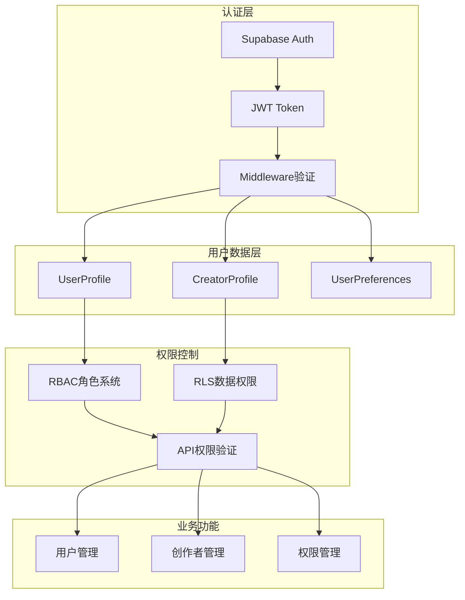
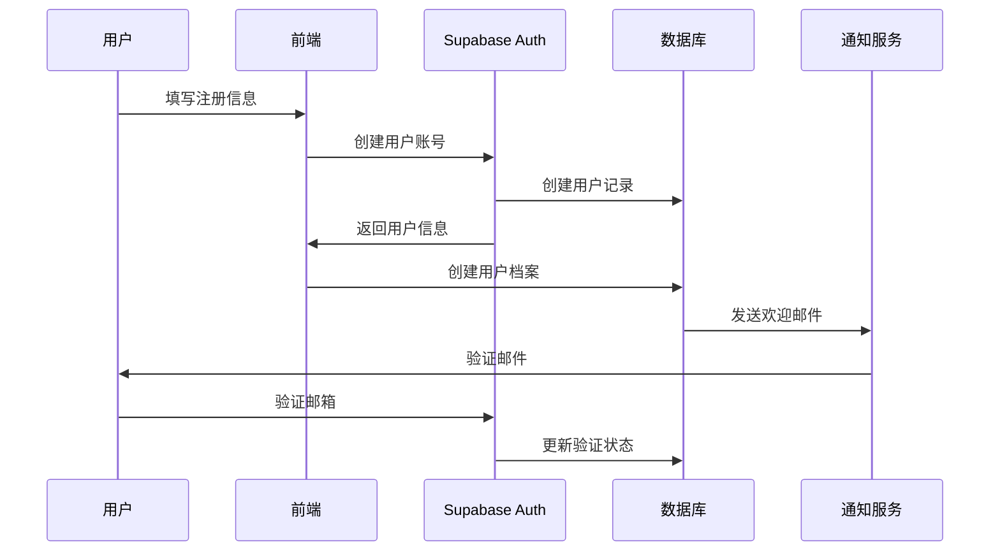
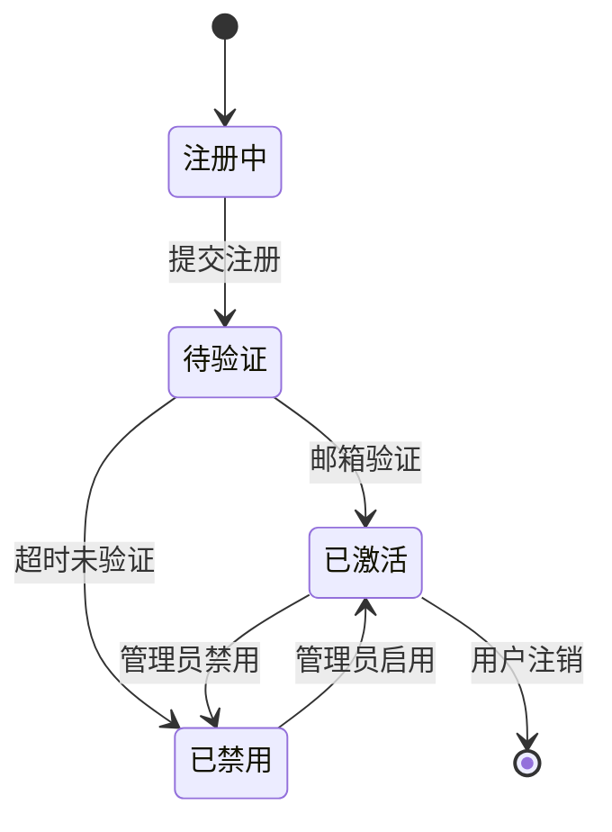

# 用户管理系统

## 📋 概述

OpenAero 用户管理系统是一个基于角色的多层级权限管理系统，支持普通用户、创作者、审核员和管理员四种角色，通过 Supabase Auth 和 PostgreSQL RLS 策略实现安全的用户认证和授权。

## 🏗️ 系统架构

### 用户管理架构图



## 🎭 角色体系

### 角色定义

| 角色 | 代码 | 描述 | 权限级别 |
|------|------|------|----------|
| **普通用户** | `USER` | 基础用户，可浏览和购买方案 | 基础 |
| **创作者** | `CREATOR` | 可创建和管理自己的方案 | 中等 |
| **审核员** | `REVIEWER` | 可审核方案和创作者申请 | 高级 |
| **管理员** | `ADMIN` | 拥有系统所有权限 | 最高 |

### 角色权限矩阵

| 功能模块 | USER | CREATOR | REVIEWER | ADMIN |
|----------|------|---------|----------|-------|
| 浏览方案 | ✅ | ✅ | ✅ | ✅ |
| 购买方案 | ✅ | ✅ | ✅ | ✅ |
| 创建方案 | ❌ | ✅ | ❌ | ✅ |
| 管理自己的方案 | ❌ | ✅ | ❌ | ✅ |
| 审核方案 | ❌ | ❌ | ✅ | ✅ |
| 申请创作者 | ✅ | ❌ | ❌ | ✅ |
| 审核创作者申请 | ❌ | ❌ | ✅ | ✅ |
| 用户管理 | ❌ | ❌ | ❌ | ✅ |
| 系统配置 | ❌ | ❌ | ❌ | ✅ |

## 👤 用户生命周期

### 用户注册流程



### 状态流转



## 📊 数据模型

### 核心表结构

#### 1. users (Supabase Auth)
```sql
-- Supabase Auth 自动管理
CREATE TABLE auth.users (
    id UUID PRIMARY KEY,
    email TEXT UNIQUE NOT NULL,
    email_confirmed BOOLEAN DEFAULT FALSE,
    phone TEXT,
    phone_confirmed BOOLEAN DEFAULT FALSE,
    created_at TIMESTAMP WITH TIME ZONE DEFAULT NOW(),
    updated_at TIMESTAMP WITH TIME ZONE DEFAULT NOW(),
    -- 其他 Supabase Auth 字段...
);
```

#### 2. user_profiles
```sql
CREATE TABLE user_profiles (
    id UUID PRIMARY KEY DEFAULT gen_random_uuid(),
    user_id UUID NOT NULL REFERENCES auth.users(id) ON DELETE CASCADE,
    first_name TEXT,
    last_name TEXT,
    avatar_url TEXT,
    bio TEXT,
    company TEXT,
    job_title TEXT,
    location TEXT,
    website TEXT,
    role TEXT DEFAULT 'USER' CHECK (role IN ('USER', 'CREATOR', 'REVIEWER', 'ADMIN')),
    is_active BOOLEAN DEFAULT TRUE,
    last_login_at TIMESTAMP WITH TIME ZONE,
    created_at TIMESTAMP WITH TIME ZONE DEFAULT NOW(),
    updated_at TIMESTAMP WITH TIME ZONE DEFAULT NOW(),
    
    UNIQUE(user_id)
);
```

#### 3. creator_profiles
```sql
CREATE TABLE creator_profiles (
    id UUID PRIMARY KEY DEFAULT gen_random_uuid(),
    user_id UUID NOT NULL REFERENCES auth.users(id) ON DELETE CASCADE,
    verification_status TEXT DEFAULT 'PENDING' CHECK (
        verification_status IN ('PENDING', 'APPROVED', 'REJECTED')
    ),
    verified_at TIMESTAMP WITH TIME ZONE,
    rejection_reason TEXT,
    specialties TEXT[], -- 专业领域
    experience_years INTEGER,
    portfolio_urls TEXT[],
    social_links JSONB,
    revenue DECIMAL(12,2) DEFAULT 0,
    created_at TIMESTAMP WITH TIME ZONE DEFAULT NOW(),
    updated_at TIMESTAMP WITH TIME ZONE DEFAULT NOW(),
    
    UNIQUE(user_id)
);
```

#### 4. user_preferences
```sql
CREATE TABLE user_preferences (
    id UUID PRIMARY KEY DEFAULT gen_random_uuid(),
    user_id UUID NOT NULL REFERENCES auth.users(id) ON DELETE CASCADE,
    language TEXT DEFAULT 'zh-CN',
    timezone TEXT DEFAULT 'Asia/Shanghai',
    email_notifications BOOLEAN DEFAULT TRUE,
    push_notifications BOOLEAN DEFAULT TRUE,
    marketing_emails BOOLEAN DEFAULT FALSE,
    theme TEXT DEFAULT 'light' CHECK (theme IN ('light', 'dark', 'auto')),
    created_at TIMESTAMP WITH TIME ZONE DEFAULT NOW(),
    updated_at TIMESTAMP WITH TIME ZONE DEFAULT NOW(),
    
    UNIQUE(user_id)
);
```

## 🔐 认证机制

### JWT Token 结构

```typescript
interface JWTPayload {
  aud: string;          // Audience
  exp: number;          // Expiration time
  sub: string;          // User ID
  email: string;        // User email
  phone?: string;       // User phone
  app_metadata: {
    provider?: string;
    providers?: string[];
  };
  user_metadata: {
    name?: string;
    first_name?: string;
    last_name?: string;
  };
  role?: string;        // User role
}
```

### 认证中间件

```typescript
// src/middleware.ts
import { createMiddlewareClient } from '@supabase/auth-helpers-nextjs';
import { NextResponse } from 'next/server';
import type { NextRequest } from 'next/server';

export async function middleware(req: NextRequest) {
  const res = NextResponse.next();
  const supabase = createMiddlewareClient({ req, res });

  // 刷新 session
  const {
    data: { session },
  } = await supabase.auth.getSession();

  // 保护的路由
  const protectedRoutes = ['/dashboard', '/creator', '/admin'];
  const isProtectedRoute = protectedRoutes.some(route => 
    req.nextUrl.pathname.startsWith(route)
  );

  if (isProtectedRoute && !session) {
    // 重定向到登录页
    const redirectUrl = new URL('/auth/login', req.url);
    redirectUrl.searchParams.set('redirect', req.nextUrl.pathname);
    return NextResponse.redirect(redirectUrl);
  }

  return res;
}
```

## 🛡️ 权限控制

### RLS (Row Level Security) 策略

#### 1. 用户档案访问控制
```sql
-- 用户只能查看和编辑自己的档案
CREATE POLICY "Users can view own profile" ON user_profiles
    FOR SELECT USING (auth.uid() = user_id);

CREATE POLICY "Users can update own profile" ON user_profiles
    FOR UPDATE USING (auth.uid() = user_id);

-- 管理员可以查看所有档案
CREATE POLICY "Admins can view all profiles" ON user_profiles
    FOR SELECT USING (
        EXISTS (
            SELECT 1 FROM user_profiles 
            WHERE user_id = auth.uid() AND role = 'ADMIN'
        )
    );
```

#### 2. 创作者档案控制
```sql
-- 创作者可以查看自己的档案
CREATE POLICY "Creators can view own profile" ON creator_profiles
    FOR SELECT USING (auth.uid() = user_id);

-- 审核员和管理员可以查看所有创作者档案
CREATE POLICY "Reviewers and admins can view all creator profiles" ON creator_profiles
    FOR SELECT USING (
        EXISTS (
            SELECT 1 FROM user_profiles 
            WHERE user_id = auth.uid() AND role IN ('REVIEWER', 'ADMIN')
        )
    );
```

### API 权限验证

```typescript
// src/lib/auth-helpers.ts
import { createServerComponentClient } from '@supabase/auth-helpers-nextjs';
import { cookies } from 'next/headers';
import { Database } from '@/types/database';

export async function getCurrentUser() {
  const supabase = createServerComponentClient<Database>({ cookies });
  const { data: { user } } = await supabase.auth.getUser();
  return user;
}

export async function requireAuth() {
  const user = await getCurrentUser();
  if (!user) {
    throw new Error('Unauthorized: No user session');
  }
  return user;
}

export async function requireRole(requiredRole: string) {
  const user = await requireAuth();
  const supabase = createServerComponentClient<Database>({ cookies });
  
  const { data: profile } = await supabase
    .from('user_profiles')
    .select('role')
    .eq('user_id', user.id)
    .single();

  if (!profile || profile.role !== requiredRole) {
    throw new Error(`Forbidden: Required role ${requiredRole}`);
  }

  return { user, profile };
}
```

## 🔧 API 接口

### 用户管理 API

#### 1. 获取当前用户信息
```typescript
// GET /api/users/me
export async function GET() {
  try {
    const user = await requireAuth();
    const supabase = createServerComponentClient<Database>({ cookies });
    
    const { data: profile } = await supabase
      .from('user_profiles')
      .select('*')
      .eq('user_id', user.id)
      .single();

    return NextResponse.json({
      success: true,
      data: {
        user: {
          id: user.id,
          email: user.email,
          emailConfirmed: user.email_confirmed,
        },
        profile,
      },
    });
  } catch (error) {
    return handleApiError(error);
  }
}
```

#### 2. 更新用户档案
```typescript
// PUT /api/users/me
export async function PUT(request: NextRequest) {
  try {
    const user = await requireAuth();
    const body = await request.json();
    
    const supabase = createServerComponentClient<Database>({ cookies });
    
    const { data, error } = await supabase
      .from('user_profiles')
      .update({
        first_name: body.firstName,
        last_name: body.lastName,
        bio: body.bio,
        company: body.company,
        job_title: body.jobTitle,
        location: body.location,
        website: body.website,
        updated_at: new Date().toISOString(),
      })
      .eq('user_id', user.id)
      .select()
      .single();

    if (error) throw error;

    return NextResponse.json({
      success: true,
      data,
    });
  } catch (error) {
    return handleApiError(error);
  }
}
```

#### 3. 更改密码
```typescript
// PUT /api/users/password
export async function PUT(request: NextRequest) {
  try {
    const user = await requireAuth();
    const { currentPassword, newPassword } = await request.json();
    
    const supabase = createServerComponentClient({ cookies });
    
    // 验证当前密码
    const { error: signInError } = await supabase.auth.signInWithPassword({
      email: user.email!,
      password: currentPassword,
    });
    
    if (signInError) {
      return NextResponse.json(
        { success: false, error: '当前密码不正确' },
        { status: 400 }
      );
    }
    
    // 更新密码
    const { error: updateError } = await supabase.auth.updateUser({
      password: newPassword,
    });
    
    if (updateError) throw updateError;

    return NextResponse.json({
      success: true,
      message: '密码更新成功',
    });
  } catch (error) {
    return handleApiError(error);
  }
}
```

### 管理员 API

#### 1. 获取用户列表
```typescript
// GET /api/admin/users
export async function GET(request: NextRequest) {
  try {
    await requireRole('ADMIN');
    
    const { searchParams } = new URL(request.url);
    const page = parseInt(searchParams.get('page') || '1');
    const limit = parseInt(searchParams.get('limit') || '10');
    const role = searchParams.get('role');
    const search = searchParams.get('search');
    
    const supabase = createServerComponentClient<Database>({ cookies });
    
    let query = supabase
      .from('user_profiles')
      .select(`
        *,
        auth_user:auth.users(email, email_confirmed, created_at)
      `)
      .range((page - 1) * limit, page * limit - 1);
    
    if (role) {
      query = query.eq('role', role);
    }
    
    if (search) {
      query = query.or(`first_name.ilike.%${search}%,last_name.ilike.%${search}%,company.ilike.%${search}%`);
    }
    
    const { data, error, count } = await query;
    
    if (error) throw error;

    return NextResponse.json({
      success: true,
      data: {
        users: data,
        pagination: {
          page,
          limit,
          total: count || 0,
          pages: Math.ceil((count || 0) / limit),
        },
      },
    });
  } catch (error) {
    return handleApiError(error);
  }
}
```

#### 2. 更新用户状态
```typescript
// PUT /api/admin/users/[id]/status
export async function PUT(
  request: NextRequest,
  { params }: { params: { id: string } }
) {
  try {
    await requireRole('ADMIN');
    const { isActive, role } = await request.json();
    
    const supabase = createServerComponentClient<Database>({ cookies });
    
    const { data, error } = await supabase
      .from('user_profiles')
      .update({
        is_active: isActive,
        role,
        updated_at: new Date().toISOString(),
      })
      .eq('user_id', params.id)
      .select()
      .single();
    
    if (error) throw error;

    return NextResponse.json({
      success: true,
      data,
    });
  } catch (error) {
    return handleApiError(error);
  }
}
```

## 📈 用户统计

### 统计数据查询

```typescript
// src/lib/user-stats.ts
export async function getUserStats() {
  const supabase = createServerComponentClient<Database>({ cookies });
  
  const [
    totalUsers,
    activeUsers,
    usersByRole,
    newUsersThisMonth,
    userGrowth,
  ] = await Promise.all([
    // 总用户数
    supabase.from('user_profiles').select('id', { count: 'exact' }),
    
    // 活跃用户数（30天内登录）
    supabase
      .from('user_profiles')
      .select('id', { count: 'exact' })
      .gte('last_login_at', new Date(Date.now() - 30 * 24 * 60 * 60 * 1000).toISOString()),
    
    // 按角色分组
    supabase
      .from('user_profiles')
      .select('role')
      .then(({ data }) => {
        const grouped = data?.reduce((acc, user) => {
          acc[user.role] = (acc[user.role] || 0) + 1;
          return acc;
        }, {} as Record<string, number>);
        return grouped || {};
      }),
    
    // 本月新用户
    supabase
      .from('user_profiles')
      .select('id', { count: 'exact' })
      .gte('created_at', new Date(new Date().getFullYear(), new Date().getMonth(), 1).toISOString()),
    
    // 用户增长趋势（最近6个月）
    supabase
      .from('user_profiles')
      .select('created_at')
      .gte('created_at', new Date(Date.now() - 6 * 30 * 24 * 60 * 60 * 1000).toISOString())
      .then(({ data }) => {
        const monthly = data?.reduce((acc, user) => {
          const month = new Date(user.created_at).toISOString().slice(0, 7);
          acc[month] = (acc[month] || 0) + 1;
          return acc;
        }, {} as Record<string, number>);
        return monthly || {};
      }),
  ]);

  return {
    totalUsers: totalUsers.count || 0,
    activeUsers: activeUsers.count || 0,
    usersByRole,
    newUsersThisMonth: newUsersThisMonth.count || 0,
    userGrowth,
  };
}
```

## 🔍 搜索和过滤

### 高级搜索

```typescript
// src/lib/user-search.ts
interface SearchFilters {
  role?: string;
  isActive?: boolean;
  dateRange?: {
    start: string;
    end: string;
  };
  location?: string;
  company?: string;
  hasCreatorProfile?: boolean;
}

export async function searchUsers(filters: SearchFilters, pagination: Pagination) {
  const supabase = createServerComponentClient<Database>({ cookies });
  
  let query = supabase
    .from('user_profiles')
    .select(`
      *,
      auth_user:auth.users(email, email_confirmed, created_at),
      creator_profile:creator_profiles(
        verification_status,
        specialties,
        revenue
      )
    `, { count: 'exact' });
  
  // 应用过滤条件
  if (filters.role) {
    query = query.eq('role', filters.role);
  }
  
  if (filters.isActive !== undefined) {
    query = query.eq('is_active', filters.isActive);
  }
  
  if (filters.dateRange) {
    query = query
      .gte('created_at', filters.dateRange.start)
      .lte('created_at', filters.dateRange.end);
  }
  
  if (filters.location) {
    query = query.ilike('location', `%${filters.location}%`);
  }
  
  if (filters.company) {
    query = query.ilike('company', `%${filters.company}%`);
  }
  
  if (filters.hasCreatorProfile !== undefined) {
    if (filters.hasCreatorProfile) {
      query = query.not('creator_profile', 'is', null);
    } else {
      query = query.is('creator_profile', null);
    }
  }
  
  // 应用分页
  const { data, error, count } = await query
    .range(
      (pagination.page - 1) * pagination.limit,
      pagination.page * pagination.limit - 1
    )
    .order('created_at', { ascending: false });
  
  if (error) throw error;
  
  return {
    users: data,
    total: count || 0,
    page: pagination.page,
    limit: pagination.limit,
  };
}
```

## 📧 通知系统

### 用户通知事件

```typescript
// src/lib/user-notifications.ts
export enum UserNotificationEvent {
  REGISTERED = 'user.registered',
  EMAIL_VERIFIED = 'user.email_verified',
  PASSWORD_CHANGED = 'user.password_changed',
  PROFILE_UPDATED = 'user.profile_updated',
  ROLE_CHANGED = 'user.role_changed',
  ACCOUNT_DISABLED = 'user.account_disabled',
  ACCOUNT_ENABLED = 'user.account_enabled',
}

export async function sendUserNotification(
  userId: string,
  event: UserNotificationEvent,
  data?: any
) {
  const supabase = createServerComponentClient<Database>({ cookies });
  
  // 获取用户信息
  const { data: user } = await supabase
    .from('user_profiles')
    .select(`
      *,
      auth_user:auth.users(email)
    `)
    .eq('user_id', userId)
    .single();
  
  if (!user) return;
  
  // 获取通知偏好
  const { data: preferences } = await supabase
    .from('user_preferences')
    .select('*')
    .eq('user_id', userId)
    .single();
  
  // 根据事件类型发送通知
  switch (event) {
    case UserNotificationEvent.REGISTERED:
      if (preferences?.email_notifications) {
        await sendWelcomeEmail(user.auth_user.email, user);
      }
      break;
      
    case UserNotificationEvent.EMAIL_VERIFIED:
      if (preferences?.email_notifications) {
        await sendEmailVerifiedEmail(user.auth_user.email, user);
      }
      break;
      
    // ... 其他事件
  }
}
```

## 🛠️ 最佳实践

### 1. 密码安全
- 使用 Supabase Auth 的内置密码强度验证
- 实施密码重置流程
- 记录密码更改历史

### 2. 会话管理
- 设置合理的 JWT 过期时间
- 实现刷新令牌机制
- 监控异常登录行为

### 3. 数据保护
- 使用 RLS 限制数据访问
- 敏感数据加密存储
- 定期备份用户数据

### 4. 审计日志
```typescript
// src/lib/user-audit.ts
export async function logUserAction(
  userId: string,
  action: string,
  details?: any
) {
  const supabase = createServerComponentClient<Database>({ cookies });
  
  await supabase.from('audit_logs').insert({
    user_id: userId,
    action,
    details,
    ip_address: details?.ip,
    user_agent: details?.userAgent,
    created_at: new Date().toISOString(),
  });
}
```

## 🔧 故障排除

### 常见问题

#### 1. 用户无法登录
```typescript
// 检查用户状态
async function checkUserStatus(email: string) {
  const supabase = createServerComponentClient<Database>({ cookies });
  
  const { data: authUser } = await supabase.auth.admin.getUserByEmail(email);
  if (!authUser) {
    return { error: '用户不存在' };
  }
  
  const { data: profile } = await supabase
    .from('user_profiles')
    .select('is_active, role')
    .eq('user_id', authUser.id)
    .single();
  
  if (!profile?.is_active) {
    return { error: '用户账户已被禁用' };
  }
  
  return { user: authUser, profile };
}
```

#### 2. 角色权限不生效
```typescript
// 检查角色权限映射
function checkRolePermissions(role: string) {
  const permissions = {
    USER: ['read:own_profile', 'read:solutions', 'create:orders'],
    CREATOR: ['read:own_profile', 'create:solutions', 'manage:own_solutions'],
    REVIEWER: ['read:all_profiles', 'review:solutions', 'review:creators'],
    ADMIN: ['*'], // 所有权限
  };
  
  return permissions[role] || [];
}
```

#### 3. RLS 策略问题
```sql
-- 检查 RLS 策略状态
SELECT 
    schemaname,
    tablename,
    policyname,
    permissive,
    roles,
    cmd,
    qual,
    with_check
FROM pg_policies 
WHERE tablename IN ('user_profiles', 'creator_profiles');
```

---

## 📚 相关文档

- [API 文档](./API_DOCUMENTATION.md) - 完整的 API 接口文档
- [安全指南](./SECURITY.md) - 认证和授权安全最佳实践
- [数据库架构](./DATABASE_SCHEMA.md) - 数据库设计详情
- [开发指南](./DEVELOPMENT_GUIDE.md) - 开发环境搭建和规范

---

*最后更新: 2025-01-16*