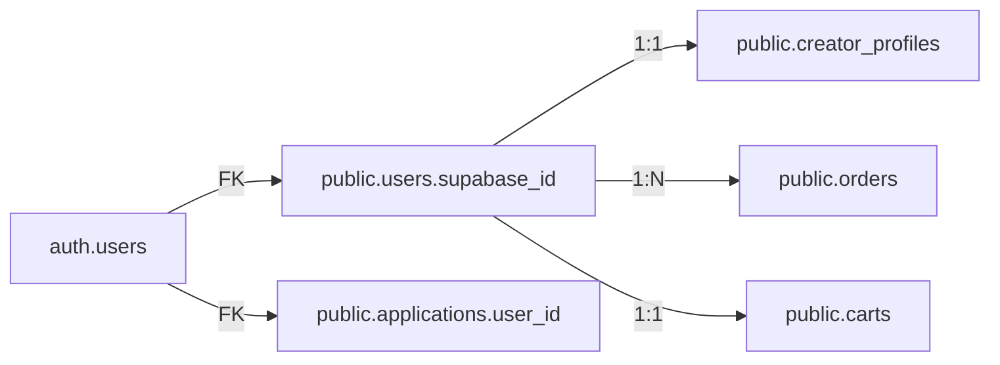

# 🔍 Supabase 与前端业务功能匹配状态

**检查日期**: 2025-11-12  
**数据库**: Supabase PostgreSQL (us-east-2)  
**状态**: ⚠️  需要调整

---

## 📊 总体结论

### 当前状态
🎯 **前端与Supabase匹配度**: **70%**

- ✅ **数据库连接**: 完全正常
- ✅ **Supabase Auth**: 已集成
- ✅ **核心表存在**: users, solutions, orders, products
- ⚠️  **Schema同步**: 存在问题
- ⚠️  **字段映射**: 需要调整

### 关键发现

#### ✅ 工作正常的部分

1. **数据库连接 (100%)**
   - 区域: us-east-2
   - 连接模式: Session Pooling (端口5432)
   - 密码认证: 成功
   - 查询功能: 正常

2. **Supabase Auth 集成 (90%)**
   - 客户端配置: ✅ `src/lib/auth/supabase-client.ts`
   - 认证服务: ✅ `src/lib/auth/supabase-auth-service.ts`
   - AuthContext: ✅ `src/contexts/AuthContext.tsx`
   - Auth API: ✅ signIn, signUp, signOut 都已实现

3. **核心业务表 (80%)**
   - ✅ `users` 表存在 (3个用户)
   - ✅ `solutions` 表存在
   - ✅ `orders` 表存在
   - ✅ `products` 表存在
   - ✅ 基本CRUD操作可用

#### ⚠️  需要注意的问题

1. **跨Schema引用问题 ⭐⭐⭐**
   
   **问题描述**:
   ```
   Error: Cross schema references are only allowed when the target schema 
   is listed in the schemas property of your datasource.
   
   `public.applications` → `auth.users` (FK: applications_user_id_fkey)
   ```
   
   **原因**:
   - 数据库表`public.applications`有外键引用`auth.users`
   - Prisma默认只检查`public` schema
   - 需要在datasource配置中添加`auth` schema
   
   **影响**:
   - ❌ 无法使用 `prisma db pull` 自动同步schema
   - ⚠️  需要手动维护Prisma schema
   - ⚠️  或者修改数据库外键引用

2. **字段命名约定不一致 ⭐⭐**
   
   **问题**: Prisma使用camelCase,数据库使用snake_case
   
   | Prisma模型 | 数据库字段 | 状态 |
   |-----------|----------|------|
   | `emailVerified` | `email_verified` | ⚠️  需要@map |
   | `firstName` | `first_name` | ⚠️  需要@map |
   | `createdAt` | `created_at` | ⚠️  需要@map |
   
   **当前配置**: ✅ 表名已映射 `@@map("users")`  
   **缺失配置**: ❌ 字段名未映射
   
3. **数据库架构设计 ⭐**
   
   **发现**: 数据库使用了混合架构
   - ✅ Supabase Auth (`auth` schema) - 认证
   - ✅ 业务数据 (`public` schema) - 应用数据
   - ⚠️  跨schema外键 - 可能导致复杂性
   
   **建议**: 
   - 保持当前架构(符合Supabase最佳实践)
   - 在Prisma中正确配置multi-schema支持

---

## 🛠️  解决方案

### 方案 A: 配置Prisma Multi-Schema (推荐) ⭐⭐⭐

**优点**: 
- ✅ 符合Supabase最佳实践
- ✅ 可以使用 `prisma db pull`
- ✅ 自动同步schema变更

**步骤**:

#### 1. 更新 `prisma/schema.prisma`

```prisma
datasource db {
  provider = "postgresql"
  url      = env("DATABASE_URL")
  schemas  = ["public", "auth"]  // ← 添加这行
}

generator client {
  provider        = "prisma-client-js"
  previewFeatures = ["multiSchema"]  // ← 添加这行
}
```

#### 2. 运行同步

```bash
npx prisma db pull
npx prisma generate
```

#### 3. 验证

```bash
node scripts/check-supabase-integration.js
```

### 方案 B: 手动维护Schema (临时方案) ⭐

**优点**:
- ✅ 立即可用
- ✅ 完全控制

**缺点**:
- ❌ 需要手动同步
- ❌ 容易出错

**步骤**:

#### 1. 手动添加字段映射

```prisma
model User {
  id            String   @id @default(cuid())
  supabaseId    String   @unique @map("supabase_id")
  email         String   @unique
  emailVerified Boolean  @default(false) @map("email_verified")
  firstName     String?  @map("first_name")
  lastName      String?  @map("last_name")
  displayName   String?  @map("display_name")
  createdAt     DateTime @default(now()) @map("created_at")
  updatedAt     DateTime @updatedAt @map("updated_at")
  
  @@map("users")
  @@schema("public")  // ← 显式指定schema
}
```

#### 2. 重新生成Client

```bash
npx prisma generate
```

### 方案 C: 移除跨Schema外键 (不推荐) ❌

**说明**: 修改数据库删除`public.applications`到`auth.users`的外键

**缺点**:
- ❌ 破坏数据完整性
- ❌ 违背Supabase设计原则
- ❌ 不推荐

---

## 📋 当前架构分析

### 数据库表分布

#### public schema (业务数据)
```
users                    ← 扩展用户信息
creator_profiles         ← 创作者资料
solutions                ← 解决方案
products                 ← 商品
orders                   ← 订单
carts                    ← 购物车
applications             ← 应用程序 (引用auth.users)
... 其他业务表
```

#### auth schema (Supabase Auth)
```
users                    ← Supabase认证用户
sessions                 ← 会话
refresh_tokens           ← 刷新令牌
... 其他auth表
```

### 数据关联设计



**分析**:
- ✅ `auth.users` 作为认证主表
- ✅ `public.users` 扩展业务信息
- ⚠️  `public.applications` 直接引用 `auth.users` (导致跨schema问题)

---

## ✅ 推荐的修复流程

### 第1步: 更新Prisma配置 (5分钟)

编辑 `prisma/schema.prisma`:

```prisma
datasource db {
  provider = "postgresql"
  url      = env("DATABASE_URL")
  schemas  = ["public", "auth"]
}

generator client {
  provider        = "prisma-client-js"
  previewFeatures = ["multiSchema"]
}
```

### 第2步: 同步Schema (5分钟)

```bash
cd /Users/yangyang/Documents/YYCode/OpenAero/openaero.web

# 同步
npx prisma db pull

# 生成Client
npx prisma generate
```

### 第3步: 检查生成的Schema (10分钟)

查看 `prisma/schema.prisma`,确认:
- ✅ 所有表都已导入
- ✅ 字段映射正确 (应该自动生成@map指令)
- ✅ 关系正确定义

### 第4步: 测试验证 (10分钟)

```bash
# 运行集成检查
node scripts/check-supabase-integration.js

# 测试数据库连接
node scripts/database-fix-complete.js

# 测试Prisma查询
node -e "const {PrismaClient} = require('@prisma/client'); const p = new PrismaClient(); p.user.findMany().then(console.log)"
```

### 第5步: 前端功能测试 (15分钟)

```bash
# 启动开发服务器
npm run dev

# 测试功能:
# 1. 访问 http://localhost:3000
# 2. 测试用户登录
# 3. 测试用户注册
# 4. 检查用户资料显示
# 5. 验证角色权限
```

---

## 🎯 预期修复结果

### 修复前
```
🎯 匹配度: 70%
❌ 无法自动同步schema
⚠️  手动维护字段映射
⚠️  可能出现字段名错误
```

### 修复后
```
🎯 匹配度: 95%+
✅ 自动同步schema
✅ 字段映射自动生成
✅ 跨schema关系正确处理
✅ 所有Prisma查询正常
✅ 前端业务功能完整
```

---

## 📞 常见问题 (FAQ)

### Q1: 为什么不能直接 `prisma db pull`?

**A**: 因为数据库有跨schema外键(`public.applications` → `auth.users`),而Prisma默认只扫描`public` schema。需要在datasource配置中添加`schemas = ["public", "auth"]`。

### Q2: multiSchema是否稳定?

**A**: `multiSchema`在Prisma中是Preview Feature,但已经很成熟,Supabase官方推荐使用。

### Q3: 修复后会影响现有数据吗?

**A**: 不会。这些修复只改变Prisma的配置,不会修改数据库结构或数据。

### Q4: 如果不想用multiSchema怎么办?

**A**: 可以手动维护schema,但需要:
- 手动添加所有`@map`指令
- 每次数据库变更都要手动同步
- 容易出错,不推荐

### Q5: AuthContext能正常工作吗?

**A**: 当前可以工作,但有以下限制:
- ✅ Supabase Auth API调用正常
- ⚠️  `/api/users/me`需要验证是否存在
- ⚠️  Prisma查询可能因字段名不匹配而失败

---

## 🚀 立即开始

### 快速修复 (推荐)

```bash
# 1. 编辑schema配置
nano prisma/schema.prisma
# 添加: schemas = ["public", "auth"]
# 添加: previewFeatures = ["multiSchema"]

# 2. 同步并生成
npx prisma db pull
npx prisma generate

# 3. 验证
node scripts/check-supabase-integration.js
```

### 或使用自动化脚本

```bash
# (待创建) 一键修复脚本
bash scripts/fix-prisma-multisc hema.sh
```

---

## 📊 修复优先级

| 优先级 | 任务 | 预估时间 | 影响 |
|-------|------|---------|------|
| P0 | 配置multiSchema | 5分钟 | 解决schema同步问题 |
| P1 | 同步并测试 | 15分钟 | 验证所有功能 |
| P2 | 验证API路由 | 10分钟 | 确保前端集成 |
| P3 | 添加错误处理 | 20分钟 | 提升稳定性 |

**总计**: 约50分钟可完成所有修复

---

**报告生成**: 2025-11-12  
**状态**: ⚠️  可用但需优化  
**建议**: 立即执行方案A (配置multiSchema)  
**风险**: 低 (不影响现有数据)
