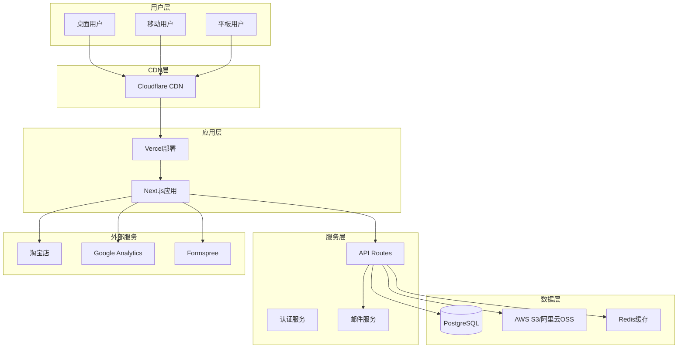
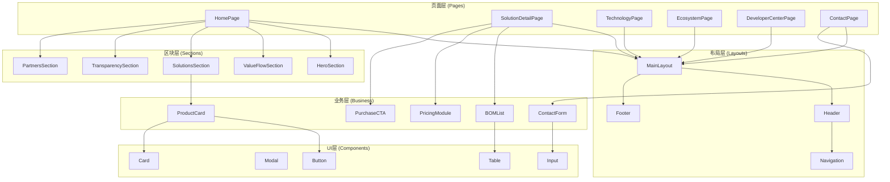
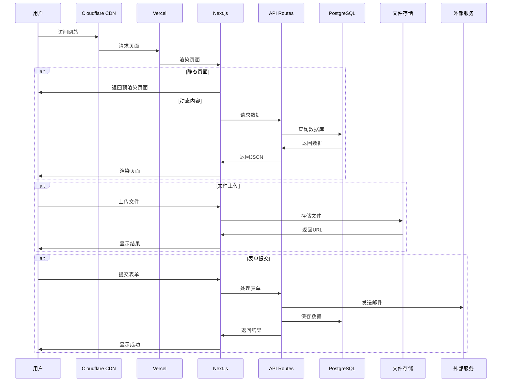
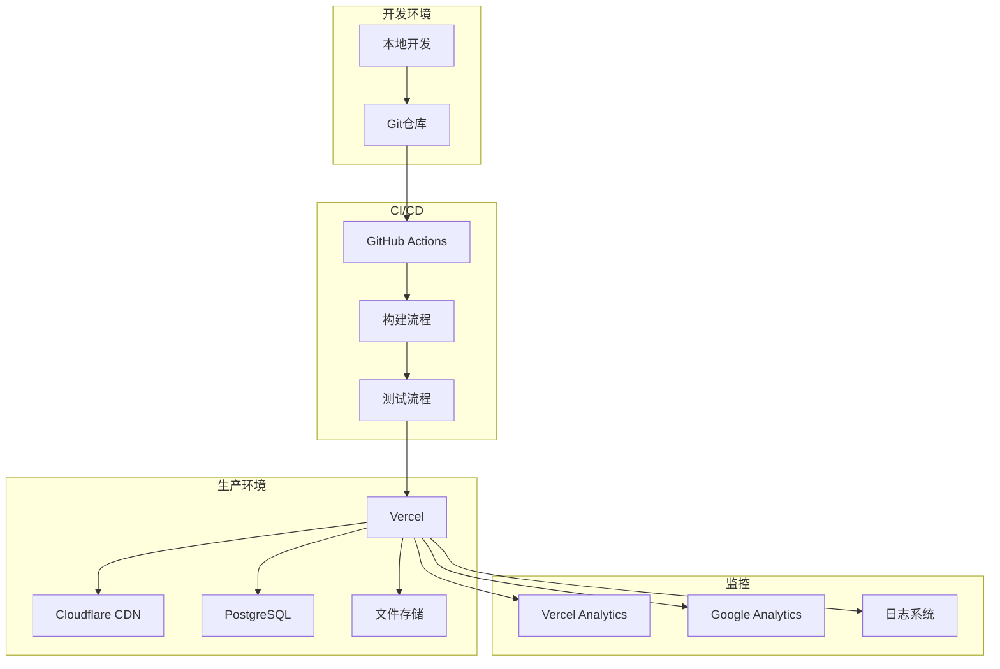
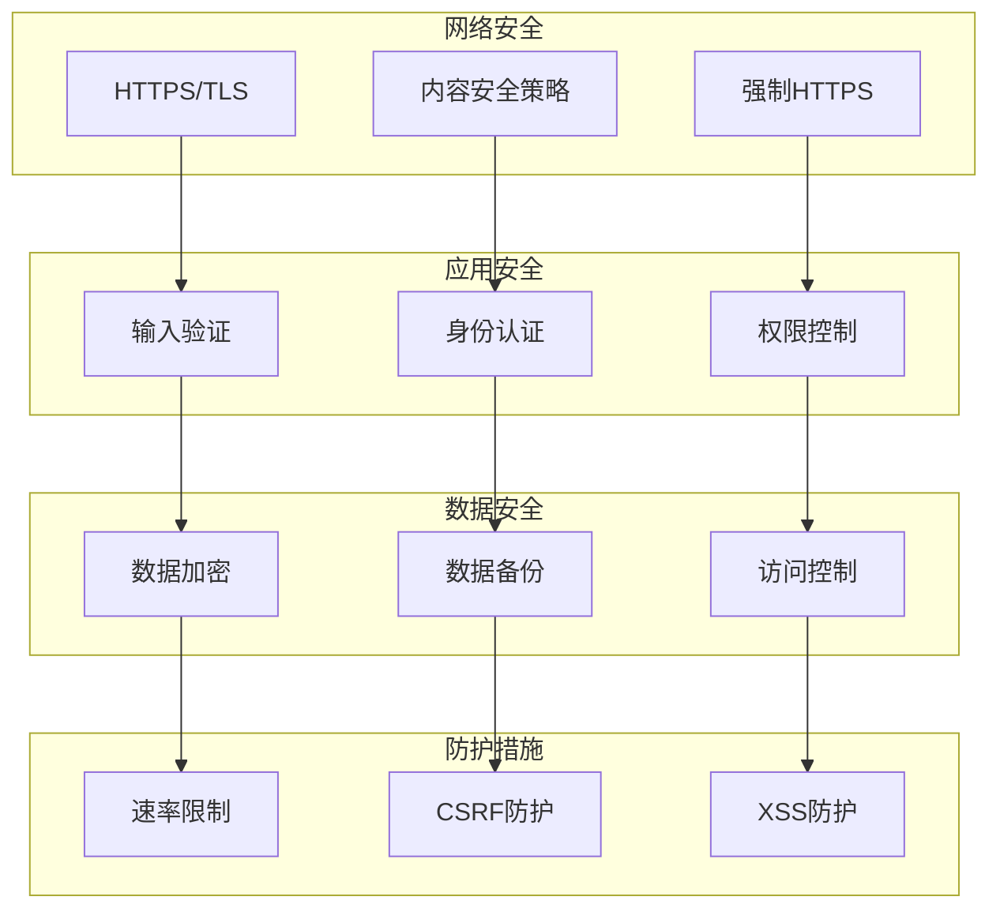
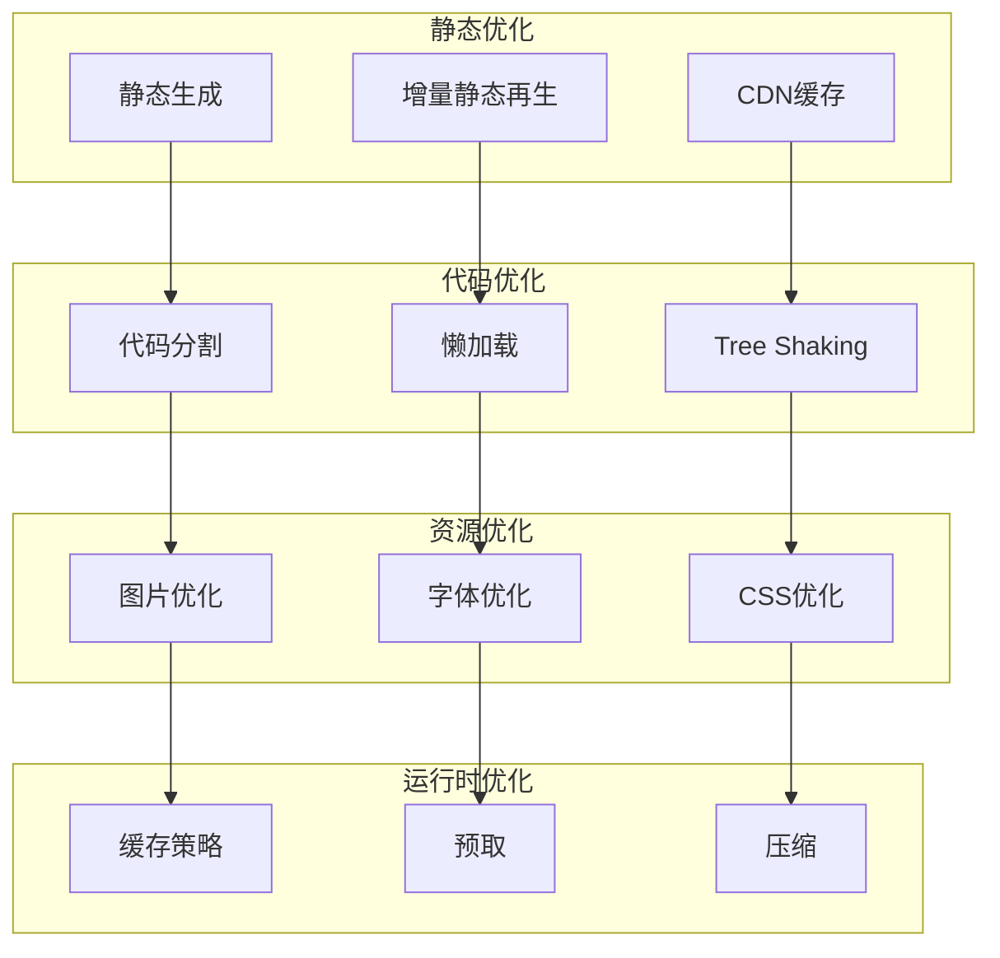
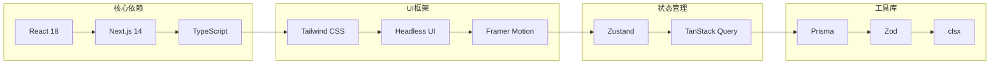

# GLAD-N 网站技术架构图

## 1. 整体技术架构



## 2. 前端组件架构



## 3. 数据流架构



## 4. 部署架构



## 5. 安全架构



## 6. 性能优化架构



## 7. 组件依赖关系



## 8. 页面路由结构

```mermaid
graph TD
    ROOT[/] --> HOME[首页]
    ROOT --> SOLUTIONS[/solutions]
    ROOT --> TECHNOLOGY[/technology]
    ROOT --> PARTNERS[/partners]
    ROOT --> DEVELOPER[/developer]
    ROOT --> ABOUT[/about]
    ROOT --> CONTACT[/contact]
    
    SOLUTIONS --> S1[/solutions/glad-n-s1]
    SOLUTIONS --> P1[/solutions/glad-n-p1]
    
    DEVELOPER --> DOCS[/developer/docs]
    DEVELOPER --> DOWNLOADS[/developer/downloads]
    DEVELOPER --> TUTORIALS[/developer/tutorials]
    DEVELOPER --> FAQ[/developer/faq]
    
    DOCS --> DOC_DETAIL[/developer/docs/[slug]]
    TUTORIALS --> TUTORIAL_DETAIL[/developer/tutorials/[slug]]
```

这些架构图展示了GLAD-N网站的完整技术架构，包括：

1. **整体技术架构**：展示了从用户到数据层的完整技术栈
2. **前端组件架构**：展示了组件的分层和依赖关系
3. **数据流架构**：展示了数据在系统中的流动过程
4. **部署架构**：展示了从开发到生产的完整部署流程
5. **安全架构**：展示了各个层面的安全措施
6. **性能优化架构**：展示了性能优化的各个方面
7. **组件依赖关系**：展示了技术栈中各个库的依赖关系
8. **页面路由结构**：展示了网站的路由组织方式

这个架构设计充分考虑了PRD中的需求，包括性能要求、SEO优化、安全性、可维护性等各个方面。
