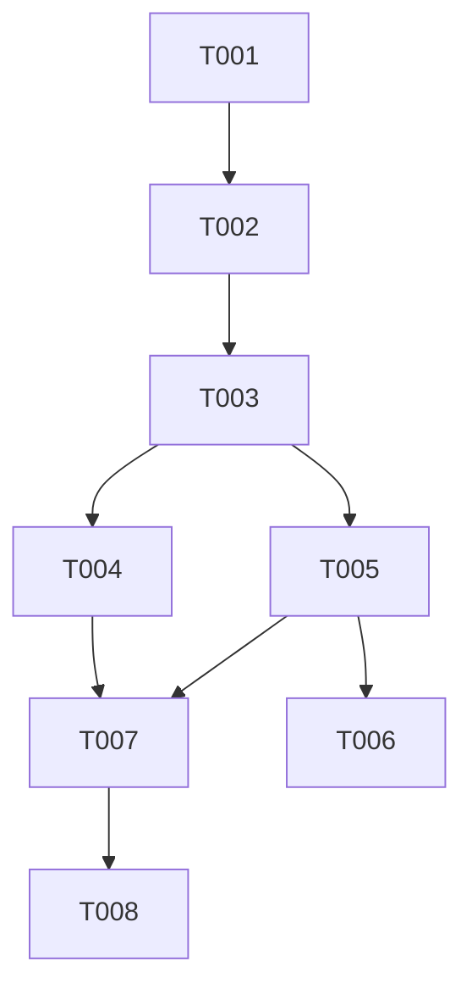

# 任务清单：最小化双语支持实现

## P0：基础设施搭建 (估计：1天)

### T001：依赖安装与配置
- [ ] 任务：安装 next-intl 依赖
  - 执行 `npm install next-intl@latest`
  - 验证安装版本与依赖兼容性
- [ ] 任务：配置 Next.js 国际化路由
  - 更新 `next.config.js`
  - 配置语言选项：zh（默认）和 en
  - 验证路由配置生效

### T002：翻译文件基础结构
- [ ] 任务：创建基础翻译文件
  - 创建 `messages/` 目录
  - 创建 `zh.json` 和 `en.json` 文件
  - 实现按功能模块分组的结构
- [ ] 任务：添加初始翻译内容
  - 添加公共模块翻译（按钮、标签等）
  - 添加核心功能模块翻译
  - 验证翻译文件格式正确性

## P1：核心功能实现 (估计：2天)

### T003：国际化工具类开发
- [ ] 任务：创建 i18n 工具类
  - 创建 `src/lib/i18n.ts`
  - 实现消息加载逻辑
  - 实现服务端回退机制
- [ ] 任务：实现持久化存储
  - 实现 Cookie 存储逻辑
  - 实现 localStorage 存储逻辑
  - 实现存储同步机制

### T004：语言切换组件开发
- [ ] 任务：创建切换组件
  - 创建 `src/components/ui/LanguageSwitcher.tsx`
  - 实现切换 UI 界面
  - 实现切换事件处理
- [ ] 任务：集成持久化功能
  - 集成 Cookie 和 localStorage 存储
  - 实现语言偏好读取逻辑
  - 测试切换功能和持久化

## P2：工程保障实现 (估计：2天)

### T005：翻译验证工具开发
- [ ] 任务：创建静态验证脚本
  - 创建验证脚本文件
  - 实现翻译完整性检查
  - 实现翻译键一致性验证
- [ ] 任务：集成构建流程
  - 添加到 npm scripts
  - 配置错误报告格式
  - 测试验证流程

### T006：CI/CD 集成
- [ ] 任务：更新 CI 工作流
  - 添加翻译验证步骤
  - 配置构建时检查
  - 测试 CI 流程

### T007：测试实现
- [ ] 任务：单元测试开发
  - 编写消息加载测试
  - 编写回退逻辑测试
  - 编写持久化测试
- [ ] 任务：集成测试开发
  - 编写路由切换测试
  - 编写语言切换测试
  - 验证测试覆盖率

## P3：文档完善 (估计：1天)

### T008：开发文档编写
- [ ] 任务：创建使用指南
  - 编写翻译文件结构说明
  - 编写开发者使用指南
  - 编写翻译工作流程说明
- [ ] 任务：维护文档更新
  - 更新 README.md
  - 创建 INTERNATIONALIZATION.md
  - 添加示例和最佳实践

## 依赖关系

## 工作量估计
- 总计工作量：6个工作日
- 建议团队规模：1-2人
- 关键路径：T001 -> T002 -> T003 -> T004/T005 -> T007 -> T008

## 验收检查清单

### 功能验收
- [ ] 路由正确处理语言前缀
- [ ] 语言切换功能正常工作
- [ ] 翻译内容正确显示
- [ ] 持久化功能正常工作

### 性能验收
- [ ] 首次加载时间符合要求
- [ ] 语言切换响应及时
- [ ] 资源加载优化合理

### 工程验收
- [ ] 所有测试通过
- [ ] CI/CD 集成正常
- [ ] 文档完整可用

## 里程碑

1. M1：基础设施就绪（T001-T002）
   - 完成依赖安装和配置
   - 完成翻译文件基础结构

2. M2：核心功能可用（T003-T004）
   - 完成工具类开发
   - 完成语言切换功能

3. M3：工程保障到位（T005-T007）
   - 完成验证工具开发
   - 完成测试实现

4. M4：文档交付完成（T008）
   - 完成所有文档编写
   - 完成最终验收