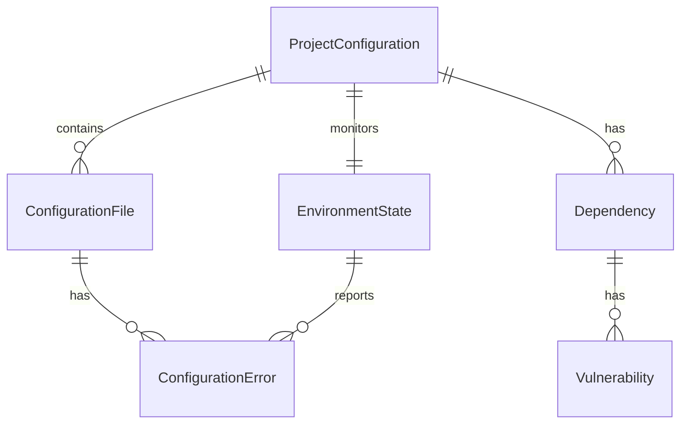

# Data Model: Project Environment Optimization

**Date**: 2024-10-23  
**Feature**: Project Environment Optimization  
**Purpose**: Define data structures and relationships for environment configuration management

## Core Entities

### ProjectConfiguration
Represents the overall project setup and configuration state.

**Attributes**:
- `id`: string (unique identifier)
- `name`: string (project name)
- `version`: string (project version)
- `nodeVersion`: string (required Node.js version)
- `packageManager`: 'npm' | 'yarn' | 'pnpm' (package manager type)
- `framework`: string (Next.js version)
- `typescriptVersion`: string (TypeScript version)
- `lastUpdated`: Date (last configuration update)
- `isValid`: boolean (configuration validity status)

**Relationships**:
- Has many `ConfigurationFile`
- Has many `Dependency`
- Has one `EnvironmentState`

**Validation Rules**:
- Node.js version must be >= 18.0.0
- TypeScript version must be >= 5.3.0
- All required configuration files must exist
- Package.json must have valid scripts section

### ConfigurationFile
Represents individual configuration files in the project.

**Attributes**:
- `id`: string (unique identifier)
- `name`: string (file name)
- `path`: string (file path)
- `type`: 'package' | 'typescript' | 'nextjs' | 'tailwind' | 'jest' | 'eslint' | 'prettier' | 'other'
- `content`: string (file content)
- `isValid`: boolean (file validity status)
- `lastModified`: Date (last modification time)
- `size`: number (file size in bytes)

**Relationships**:
- Belongs to `ProjectConfiguration`
- Has many `ConfigurationError`

**Validation Rules**:
- File must exist and be readable
- Content must be valid JSON/YAML/JavaScript
- Type-specific validation rules apply
- File size must be < 1MB

### Dependency
Represents project dependencies and their status.

**Attributes**:
- `id`: string (unique identifier)
- `name`: string (package name)
- `version`: string (installed version)
- `requiredVersion`: string (required version range)
- `type`: 'production' | 'development' | 'peer' | 'optional'
- `isInstalled`: boolean (installation status)
- `isCompatible`: boolean (version compatibility)
- `lastChecked`: Date (last compatibility check)
- `vulnerabilities`: Vulnerability[] (security issues)

**Relationships**:
- Belongs to `ProjectConfiguration`
- Has many `Vulnerability`

**Validation Rules**:
- Version must match required version range
- No critical vulnerabilities allowed
- Peer dependencies must be satisfied
- Optional dependencies can be missing

### EnvironmentState
Represents the current state of the development environment.

**Attributes**:
- `id`: string (unique identifier)
- `status`: 'healthy' | 'degraded' | 'error' | 'unknown'
- `lastChecked`: Date (last health check)
- `startupTime`: number (server startup time in ms)
- `compilationTime`: number (TypeScript compilation time in ms)
- `memoryUsage`: number (memory usage in MB)
- `cpuUsage`: number (CPU usage percentage)
- `activePorts`: number[] (list of active ports)
- `errors`: ConfigurationError[] (current errors)

**Relationships**:
- Belongs to `ProjectConfiguration`
- Has many `ConfigurationError`

**Validation Rules**:
- Startup time must be < 30000ms
- Compilation time must be < 10000ms
- Memory usage must be < 2048MB
- No critical errors allowed

### ConfigurationError
Represents errors and warnings in the configuration.

**Attributes**:
- `id`: string (unique identifier)
- `type`: 'error' | 'warning' | 'info'
- `severity`: 'critical' | 'high' | 'medium' | 'low'
- `message`: string (error message)
- `file`: string (affected file path)
- `line`: number (line number, if applicable)
- `column`: number (column number, if applicable)
- `code`: string (error code)
- `suggestion`: string (resolution suggestion)
- `timestamp`: Date (error occurrence time)

**Relationships**:
- Belongs to `ConfigurationFile` or `EnvironmentState`

**Validation Rules**:
- Message must be non-empty
- Severity must be valid enum value
- File path must be valid
- Timestamp must be recent

### Vulnerability
Represents security vulnerabilities in dependencies.

**Attributes**:
- `id`: string (unique identifier)
- `packageName`: string (affected package)
- `version`: string (affected version)
- `severity`: 'critical' | 'high' | 'medium' | 'low'
- `title`: string (vulnerability title)
- `description`: string (vulnerability description)
- `cve`: string (CVE identifier, if available)
- `patchedIn`: string (fixed in version)
- `advisoryUrl`: string (security advisory URL)
- `discoveredAt`: Date (discovery date)

**Relationships**:
- Belongs to `Dependency`

**Validation Rules**:
- Severity must be valid enum value
- Package name must match dependency
- CVE must be valid format if provided
- Advisory URL must be accessible

## State Transitions

### ProjectConfiguration States
```
[Initial] → [Validating] → [Valid] | [Invalid]
[Valid] → [Updating] → [Valid] | [Invalid]
[Invalid] → [Fixing] → [Valid] | [Invalid]
```

### EnvironmentState States
```
[Unknown] → [Checking] → [Healthy] | [Degraded] | [Error]
[Healthy] → [Monitoring] → [Healthy] | [Degraded] | [Error]
[Degraded] → [Recovering] → [Healthy] | [Error]
[Error] → [Fixing] → [Healthy] | [Degraded] | [Error]
```

## Data Validation Rules

### ProjectConfiguration Validation
- All required configuration files must exist
- Node.js version must be >= 18.0.0
- TypeScript version must be >= 5.3.0
- Package.json must have valid scripts section
- No critical configuration errors

### ConfigurationFile Validation
- File must exist and be readable
- Content must be valid for file type
- File size must be reasonable (< 1MB)
- No syntax errors in configuration

### Dependency Validation
- All production dependencies must be installed
- No critical vulnerabilities
- Version compatibility checks pass
- Peer dependencies satisfied

### EnvironmentState Validation
- Startup time within acceptable limits
- Compilation time within acceptable limits
- Memory usage within acceptable limits
- No critical errors present

## Data Relationships



## Data Access Patterns

### Read Operations
- Get project configuration by ID
- List all configuration files
- Get environment state
- List active errors
- Check dependency status

### Write Operations
- Update configuration file
- Install/update dependency
- Update environment state
- Add/remove error
- Update vulnerability status

### Query Operations
- Find configuration errors by severity
- List dependencies by type
- Get environment metrics
- Search configuration files by type
- Filter vulnerabilities by severity

## Data Persistence

### Configuration Files
- Stored as files in project directory
- Version controlled with Git
- Backed up automatically

### Runtime State
- Stored in memory during development
- Persisted to temporary files for debugging
- Reset on each startup

### Error History
- Stored in local database (SQLite)
- Rotated after 30 days
- Exported for analysis

## Data Migration

### Version Updates
- Configuration files updated automatically
- Dependencies upgraded with compatibility checks
- State data migrated to new schema

### Backup and Restore
- Configuration backed up before changes
- Rollback capability for failed updates
- State restoration from backup

## Performance Considerations

### Data Loading
- Lazy loading for large configuration files
- Caching for frequently accessed data
- Incremental updates for real-time monitoring

### Data Storage
- Efficient serialization for large objects
- Compression for historical data
- Cleanup of old error logs

### Query Optimization
- Indexed lookups for common queries
- Pagination for large result sets
- Caching for expensive operations
