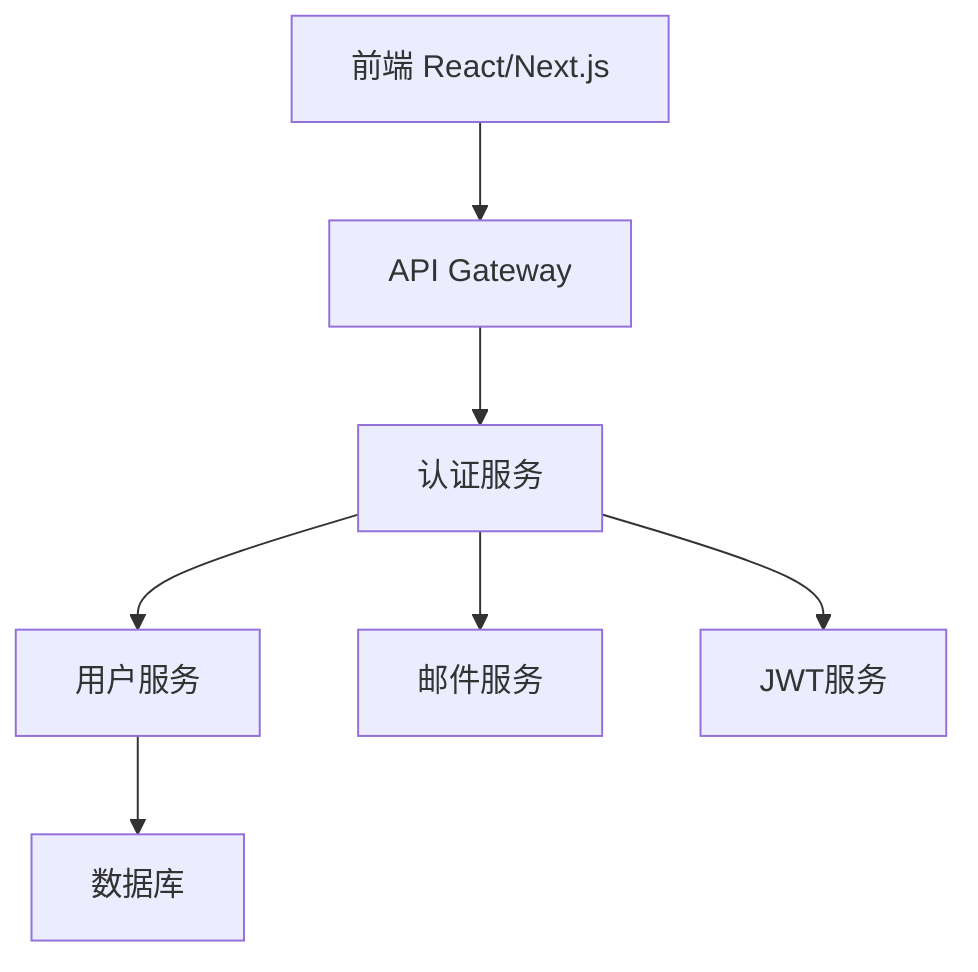
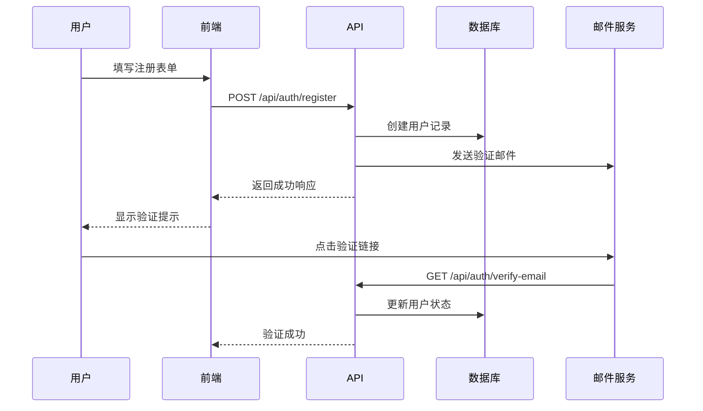
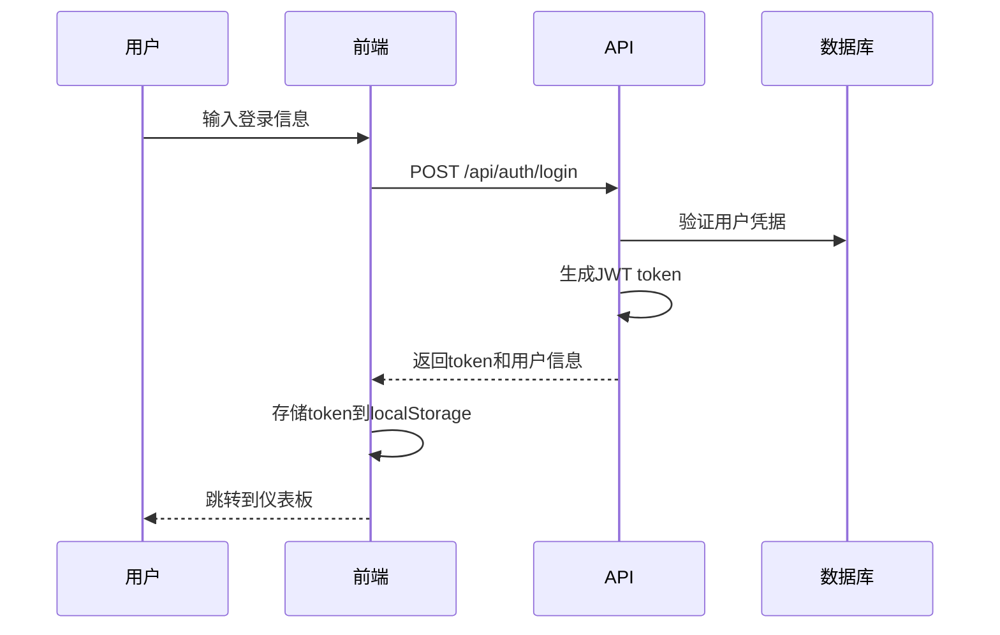

# 技术实施计划: 用户认证系统

## 概述
**功能名称**: 用户认证系统  
**计划版本**: 1.0.0  
**创建日期**: 2024-10-23  
**技术负责人**: 开发团队  
**预计工期**: 3周  

## 架构设计

### 系统架构

### 技术栈
- **前端**: Next.js 14, React 18, TypeScript, Tailwind CSS
- **后端**: Next.js API Routes, Prisma ORM
- **数据库**: PostgreSQL
- **认证**: NextAuth.js, JWT
- **邮件**: Nodemailer, SMTP
- **加密**: bcryptjs
- **验证**: Zod

## 模块划分

### 前端模块
1. **认证页面** (`src/app/auth/`)
   - 登录页面 (`login/page.tsx`)
   - 注册页面 (`register/page.tsx`)
   - 密码重置页面 (`reset-password/page.tsx`)
   - 邮箱验证页面 (`verify-email/page.tsx`)

2. **认证组件** (`src/components/auth/`)
   - 登录表单 (`LoginForm.tsx`)
   - 注册表单 (`RegisterForm.tsx`)
   - 密码重置表单 (`ResetPasswordForm.tsx`)
   - 认证保护组件 (`AuthGuard.tsx`)

3. **认证钩子** (`src/hooks/`)
   - 用户状态钩子 (`useAuth.ts`)
   - 登录钩子 (`useLogin.ts`)
   - 注册钩子 (`useRegister.ts`)

### 后端模块
1. **认证API** (`src/app/api/auth/`)
   - 注册API (`register/route.ts`)
   - 登录API (`login/route.ts`)
   - 登出API (`logout/route.ts`)
   - 验证邮箱API (`verify-email/route.ts`)
   - 重置密码API (`reset-password/route.ts`)

2. **用户API** (`src/app/api/user/`)
   - 用户信息API (`profile/route.ts`)
   - 更新用户API (`update/route.ts`)

3. **认证中间件** (`src/middleware/`)
   - JWT验证中间件 (`auth.ts`)
   - 权限检查中间件 (`permissions.ts`)

## 数据流设计

### 用户注册流程

### 用户登录流程

## 组件边界

### 前端组件边界
- **页面组件**: 负责路由和页面级状态管理
- **表单组件**: 负责表单验证和提交逻辑
- **认证钩子**: 负责认证状态管理和API调用

### API边界
- **认证API**: 处理用户注册、登录、登出等认证相关操作
- **用户API**: 处理用户信息查询和更新
- **中间件**: 处理请求认证和权限验证

## 技术选型理由

### 认证框架
- **NextAuth.js**: 提供完整的认证解决方案，支持多种认证方式
- **JWT**: 无状态认证，适合分布式系统

### 密码安全
- **bcryptjs**: 业界标准的密码哈希算法
- **密码强度验证**: 确保用户密码安全性

### 数据验证
- **Zod**: 运行时类型验证，确保API数据安全

## 性能优化策略

### 前端优化
- 表单验证优化，减少不必要的API调用
- 认证状态缓存，避免重复请求
- 懒加载认证相关组件

### 后端优化
- 数据库索引优化
- JWT token缓存
- 邮件发送队列化

## 安全考虑

### 数据安全
- 密码bcrypt加密存储
- JWT token安全配置
- 敏感数据加密传输

### 攻击防护
- 防止SQL注入
- 防止XSS攻击
- 防止CSRF攻击
- 防止暴力破解

## 监控和日志

### 认证监控
- 登录失败次数监控
- 异常登录行为检测
- 认证服务性能监控

### 安全日志
- 用户登录日志
- 密码重置日志
- 异常访问日志

## 测试策略

### 单元测试
- 认证函数测试
- 密码加密测试
- JWT token测试
- 表单验证测试

### 集成测试
- 注册流程测试
- 登录流程测试
- 密码重置测试
- 邮箱验证测试

### 安全测试
- 密码强度测试
- 认证绕过测试
- 会话管理测试

## 部署计划

### 环境配置
- **开发环境**: 本地开发，使用测试邮件服务
- **测试环境**: 自动化测试，使用测试数据库
- **生产环境**: 高可用配置，使用生产邮件服务

### 配置管理
- 环境变量配置
- 数据库连接配置
- 邮件服务配置
- JWT密钥配置

## 风险评估

### 技术风险
- **邮件服务故障**: 影响用户注册和密码重置
- **JWT密钥泄露**: 影响整个认证系统安全
- **数据库性能**: 大量用户并发时可能影响性能

### 缓解措施
- 邮件服务备份方案
- JWT密钥轮换机制
- 数据库性能优化和监控

## 成功标准
- [ ] 用户注册成功率 > 95%
- [ ] 登录响应时间 < 500ms
- [ ] 密码重置邮件送达率 > 98%
- [ ] 安全测试通过率 100%
- [ ] 用户满意度 > 4.5/5
