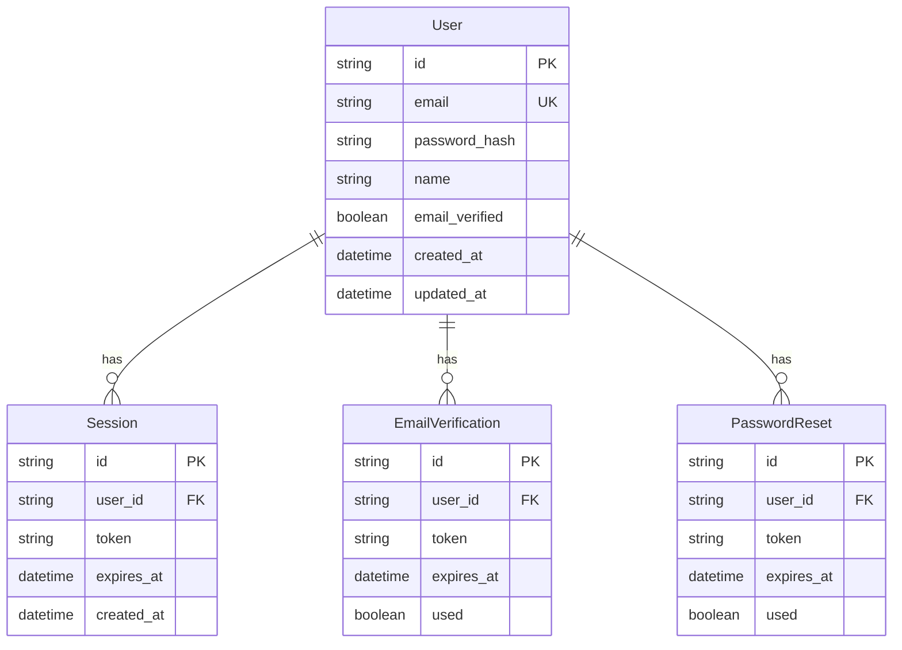

# 功能规范: 用户认证系统

## 概述
**功能名称**: 用户认证系统  
**版本**: 1.0.0  
**创建日期**: 2024-10-23  
**负责人**: 开发团队  
**状态**: 草稿  

## 功能描述
为OpenAero平台实现完整的用户认证系统，包括用户注册、登录、密码重置、邮箱验证等功能，确保平台的安全性和用户体验。

## 业务目标
- 提供安全可靠的用户身份验证机制
- 简化用户注册和登录流程，提升用户体验
- 支持多种认证方式，满足不同用户需求
- 建立用户数据基础，支持后续功能扩展

## 用户故事
### 作为 新用户
我希望 能够快速注册账户并验证邮箱  
以便 开始使用OpenAero平台的所有功能

### 作为 现有用户
我希望 能够安全登录并管理我的账户信息  
以便 访问我的个人数据和平台功能

### 作为 忘记密码的用户
我希望 能够重置我的密码  
以便 重新获得账户访问权限

## 功能需求 (FR)
### FR-1: 用户注册
**描述**: 用户可以通过邮箱注册新账户  
**优先级**: 高  
**验收标准**: 
- 用户输入邮箱、密码和确认密码
- 系统验证邮箱格式和密码强度
- 发送验证邮件到用户邮箱
- 用户点击邮件链接完成注册

### FR-2: 用户登录
**描述**: 用户可以使用邮箱和密码登录  
**优先级**: 高  
**验收标准**: 
- 用户输入邮箱和密码
- 系统验证用户凭据
- 登录成功后跳转到用户仪表板
- 支持"记住我"功能

### FR-3: 密码重置
**描述**: 用户可以通过邮箱重置密码  
**优先级**: 中  
**验收标准**: 
- 用户输入注册邮箱
- 系统发送密码重置邮件
- 用户点击邮件链接设置新密码
- 重置后自动登录

### FR-4: 邮箱验证
**描述**: 新注册用户需要验证邮箱  
**优先级**: 高  
**验收标准**: 
- 注册后发送验证邮件
- 用户点击验证链接
- 验证成功后激活账户
- 未验证用户功能受限

### FR-5: 会话管理
**描述**: 管理用户登录会话  
**优先级**: 中  
**验收标准**: 
- 支持JWT token认证
- 实现自动登出机制
- 支持多设备登录管理
- 提供登出功能

## 非功能需求 (NFR)
### NFR-1: 性能
- 登录响应时间 < 500ms
- 支持1000+并发用户登录
- 数据库查询优化

### NFR-2: 安全性
- 密码加密存储（bcrypt）
- JWT token安全配置
- 防止暴力破解攻击
- HTTPS加密传输

### NFR-3: 可用性
- 响应式设计，支持移动端
- 清晰的错误提示信息
- 无障碍访问支持

## 关键实体与关系

## 测试/验收条件
### 单元测试
- [ ] 用户注册功能测试
- [ ] 用户登录功能测试
- [ ] 密码加密测试
- [ ] JWT token生成和验证测试
- [ ] 邮箱验证功能测试

### 集成测试
- [ ] 注册到登录完整流程测试
- [ ] 密码重置流程测试
- [ ] 数据库操作测试
- [ ] 邮件发送功能测试

### 端到端测试
- [ ] 用户注册到邮箱验证完整流程
- [ ] 用户登录到访问受保护页面
- [ ] 密码重置完整流程
- [ ] 多设备登录测试

## 风险与未决项
### 技术风险
- 邮件服务可靠性问题
- JWT token安全性配置
- 数据库性能瓶颈

### 业务风险
- 用户注册转化率低
- 密码重置邮件被标记为垃圾邮件
- 多设备登录管理复杂

### 未决项
- [ ] 是否需要支持第三方登录（Google, GitHub等）
- [ ] 是否需要实现双因素认证
- [ ] 用户数据隐私政策制定

## 依赖关系
### 前置条件
- 数据库已配置并可用
- 邮件服务已配置
- 前端页面框架已搭建

### 后续功能
- 用户个人资料管理
- 权限管理系统
- 用户行为分析

## 验收标准
- [ ] 所有功能需求已实现并通过测试
- [ ] 所有非功能需求已满足
- [ ] 代码审查通过
- [ ] 安全测试通过
- [ ] 用户验收测试通过
- [ ] 性能测试通过
