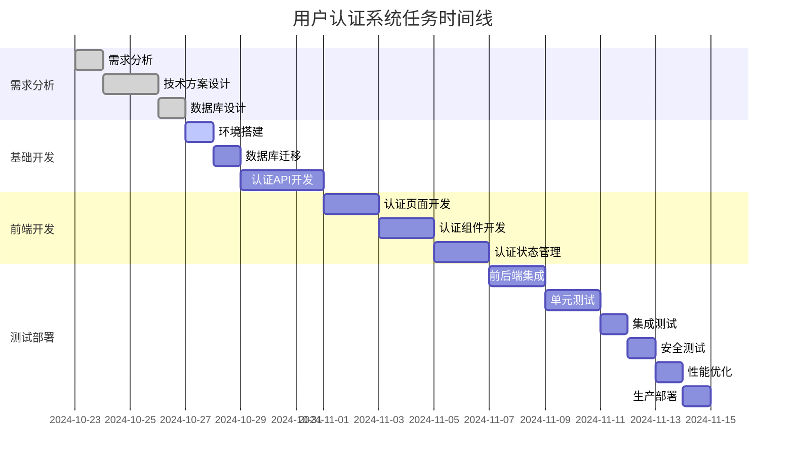

# 任务清单: 用户认证系统

## 概述
**功能名称**: 用户认证系统  
**任务版本**: 1.0.0  
**创建日期**: 2024-10-23  
**负责人**: 开发团队  
**预计完成时间**: 2024-11-13  

## 任务概览
- **总任务数**: 15
- **已完成**: 0
- **进行中**: 0
- **待开始**: 15
- **完成率**: 0%

## 任务列表

### 阶段1: 需求分析与设计
- [ ] **TASK-001**: 需求分析
  - **描述**: 详细分析用户认证需求，明确业务目标
  - **优先级**: 高
  - **预估工时**: 4小时
  - **依赖**: 无
  - **验收标准**: 需求文档完成，业务目标明确

- [ ] **TASK-002**: 技术方案设计
  - **描述**: 设计认证系统架构和实现方案
  - **优先级**: 高
  - **预估工时**: 8小时
  - **依赖**: TASK-001
  - **验收标准**: 技术方案文档完成，架构图清晰

- [ ] **TASK-003**: 数据库设计
  - **描述**: 设计用户认证相关数据库表结构
  - **优先级**: 高
  - **预估工时**: 6小时
  - **依赖**: TASK-002
  - **验收标准**: 数据库ER图完成，表结构定义清晰

### 阶段2: 基础开发
- [ ] **TASK-004**: 环境搭建
  - **描述**: 搭建认证系统开发环境和基础配置
  - **优先级**: 高
  - **预估工时**: 2小时
  - **依赖**: TASK-003
  - **验收标准**: 开发环境可用，基础配置完成

- [ ] **TASK-005**: 数据库迁移
  - **描述**: 创建用户认证相关数据库迁移脚本
  - **优先级**: 高
  - **预估工时**: 3小时
  - **依赖**: TASK-004
  - **验收标准**: 数据库迁移脚本完成，数据库结构正确

- [ ] **TASK-006**: 认证API开发
  - **描述**: 开发用户注册、登录、登出等API接口
  - **优先级**: 高
  - **预估工时**: 12小时
  - **依赖**: TASK-005
  - **验收标准**: 认证API完成，通过接口测试

### 阶段3: 前端开发
- [ ] **TASK-007**: 认证页面开发
  - **描述**: 开发登录、注册、密码重置等页面
  - **优先级**: 高
  - **预估工时**: 8小时
  - **依赖**: TASK-006
  - **验收标准**: 认证页面完成，样式统一

- [ ] **TASK-008**: 认证组件开发
  - **描述**: 开发认证相关的React组件
  - **优先级**: 高
  - **预估工时**: 10小时
  - **依赖**: TASK-007
  - **验收标准**: 认证组件完成，功能正常

- [ ] **TASK-009**: 认证状态管理
  - **描述**: 实现前端认证状态管理
  - **优先级**: 中
  - **预估工时**: 6小时
  - **依赖**: TASK-008
  - **验收标准**: 认证状态管理完成，数据流清晰

### 阶段4: 集成与测试
- [ ] **TASK-010**: 前后端集成
  - **描述**: 前后端认证功能集成
  - **优先级**: 高
  - **预估工时**: 8小时
  - **依赖**: TASK-009
  - **验收标准**: 前后端集成完成，认证流程正常

- [ ] **TASK-011**: 单元测试
  - **描述**: 编写和执行认证相关单元测试
  - **优先级**: 中
  - **预估工时**: 8小时
  - **依赖**: TASK-010
  - **验收标准**: 单元测试覆盖率 > 80%

- [ ] **TASK-012**: 集成测试
  - **描述**: 编写和执行认证集成测试
  - **优先级**: 中
  - **预估工时**: 6小时
  - **依赖**: TASK-011
  - **验收标准**: 集成测试通过

### 阶段5: 安全与部署
- [ ] **TASK-013**: 安全测试
  - **描述**: 进行认证系统安全测试
  - **优先级**: 高
  - **预估工时**: 6小时
  - **依赖**: TASK-012
  - **验收标准**: 安全测试通过

- [ ] **TASK-014**: 性能优化
  - **描述**: 优化认证系统性能
  - **优先级**: 中
  - **预估工时**: 4小时
  - **依赖**: TASK-013
  - **验收标准**: 性能指标达到预期

- [ ] **TASK-015**: 生产部署
  - **描述**: 部署认证系统到生产环境
  - **优先级**: 高
  - **预估工时**: 4小时
  - **依赖**: TASK-014
  - **验收标准**: 生产环境部署成功

## 任务依赖关系

## 资源分配
- **开发人员**: 2人
- **测试人员**: 1人
- **设计人员**: 1人
- **项目经理**: 1人

## 风险控制
### 高风险任务
- **TASK-006**: 认证API开发 - 安全要求高，实现复杂
- **TASK-010**: 前后端集成 - 可能存在接口不匹配问题
- **TASK-013**: 安全测试 - 安全漏洞可能影响整个系统

### 风险缓解措施
- 提前进行安全技术预研
- 增加代码审查环节
- 准备安全测试工具和方案

## 质量检查点
- [ ] 代码审查通过
- [ ] 单元测试覆盖率达标
- [ ] 集成测试通过
- [ ] 安全测试通过
- [ ] 性能测试通过
- [ ] 用户验收测试通过

## 交付物清单
- [ ] 认证系统源代码
- [ ] 技术文档
- [ ] 用户手册
- [ ] 部署文档
- [ ] 安全测试报告
- [ ] 性能测试报告

## 备注
- 重点关注安全性实现
- 确保用户体验流畅
- 做好数据备份和恢复方案
