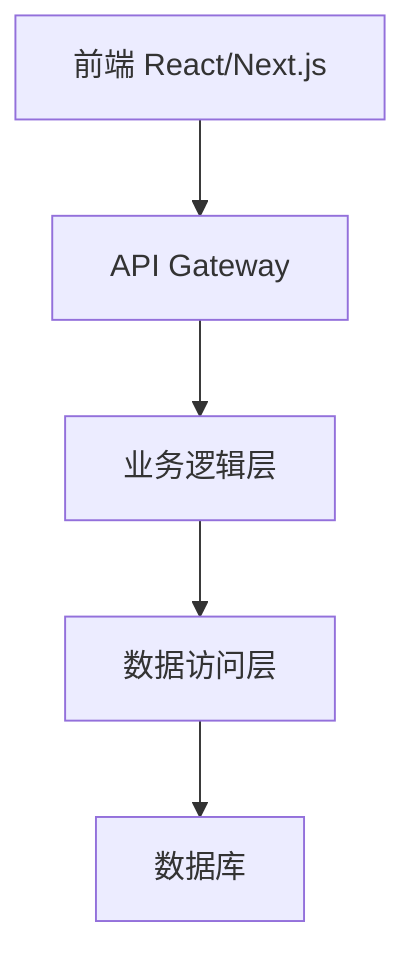
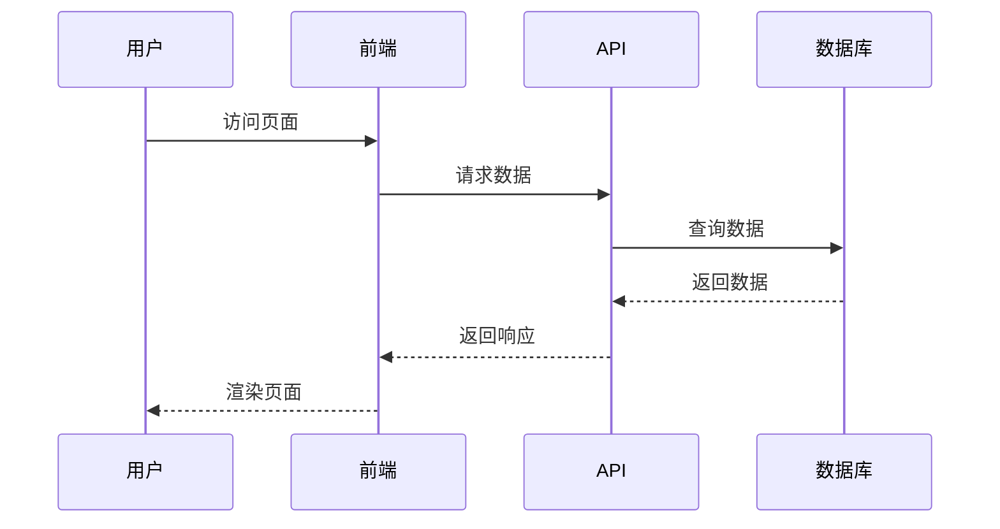
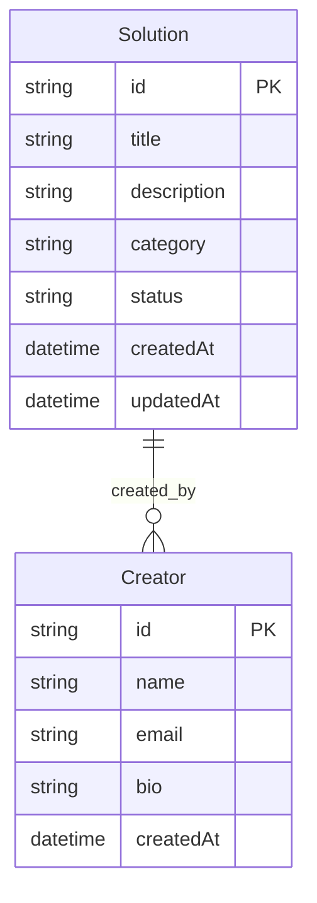

# 技术实施计划: {feature_name}

## 概述
**功能名称**: {feature_name}  
**计划版本**: 1.0.0  
**创建日期**: {date}  
**技术负责人**: {tech_lead}  
**预计工期**: {estimated_duration}  

## 架构设计

### 系统架构

### 技术栈
- **前端**: Next.js 14, React 18, TypeScript, Tailwind CSS
- **后端**: Next.js API Routes, Prisma ORM
- **数据库**: PostgreSQL
- **部署**: Docker, Kubernetes
- **监控**: Sentry, Prometheus, Grafana

## 模块划分

### 前端模块
1. **UI组件层** (`src/components/`)
   - 基础组件 (Button, Card, etc.)
   - 业务组件 (SolutionCard, SearchFilters, etc.)
   - 布局组件 (Header, Footer, MainLayout)

2. **页面层** (`src/app/`)
   - 首页 (`page.tsx`)
   - 解决方案页面 (`solutions/page.tsx`)
   - 创作者页面 (`creators/page.tsx`)

3. **状态管理层** (`src/lib/`, `src/types/`)
   - 类型定义
   - 工具函数
   - 数据验证

### 后端模块
1. **API层** (`src/app/api/`)
   - 解决方案API (`solutions/`)
   - 创作者API (`creators/`)
   - 健康检查API (`health/`)

2. **数据层** (`prisma/`)
   - 数据库模式定义
   - 数据迁移
   - 种子数据

## 数据流设计

### 用户交互流程

### 数据模型

## 组件边界

### 前端组件边界
- **页面组件**: 负责路由和页面级状态管理
- **业务组件**: 负责特定业务逻辑和UI交互
- **基础组件**: 负责通用UI元素和样式

### API边界
- **RESTful API**: 遵循REST原则，使用标准HTTP方法
- **数据验证**: 使用Zod进行请求和响应数据验证
- **错误处理**: 统一的错误响应格式

## 技术选型理由

### 前端技术
- **Next.js**: 提供SSR/SSG支持，优化SEO和性能
- **TypeScript**: 提供类型安全，减少运行时错误
- **Tailwind CSS**: 快速样式开发，保持设计一致性

### 后端技术
- **Prisma**: 类型安全的ORM，简化数据库操作
- **Zod**: 运行时类型验证，确保数据完整性

### 部署技术
- **Docker**: 容器化部署，确保环境一致性
- **Kubernetes**: 容器编排，支持自动扩缩容

## 性能优化策略

### 前端优化
- 代码分割和懒加载
- 图片优化和WebP格式
- 缓存策略优化

### 后端优化
- 数据库查询优化
- API响应缓存
- 连接池管理

## 安全考虑

### 数据安全
- HTTPS加密传输
- 敏感数据加密存储
- SQL注入防护

### 访问控制
- 用户身份验证
- 权限管理
- CSRF防护

## 监控和日志

### 应用监控
- 性能指标监控
- 错误追踪和报告
- 用户行为分析

### 基础设施监控
- 服务器资源监控
- 数据库性能监控
- 网络状态监控

## 测试策略

### 测试金字塔
- **单元测试**: 组件和函数级别测试
- **集成测试**: API和数据库集成测试
- **端到端测试**: 完整用户流程测试

### 测试工具
- **Jest**: 单元测试框架
- **Playwright**: 端到端测试工具
- **Testing Library**: React组件测试

## 部署计划

### 环境配置
- **开发环境**: 本地开发，热重载
- **测试环境**: 自动化测试，预发布验证
- **生产环境**: 高可用，性能优化

### 发布流程
1. 代码提交和审查
2. 自动化测试执行
3. 构建和打包
4. 部署到测试环境
5. 用户验收测试
6. 生产环境部署

## 风险评估

### 技术风险
- **性能风险**: 大量数据加载可能导致性能问题
- **兼容性风险**: 不同浏览器和设备兼容性

### 缓解措施
- 性能测试和优化
- 跨浏览器测试
- 渐进式增强策略

## 成功标准
- [ ] 所有功能需求已实现
- [ ] 性能指标达到预期
- [ ] 安全测试通过
- [ ] 用户验收测试通过
- [ ] 文档完整且准确
