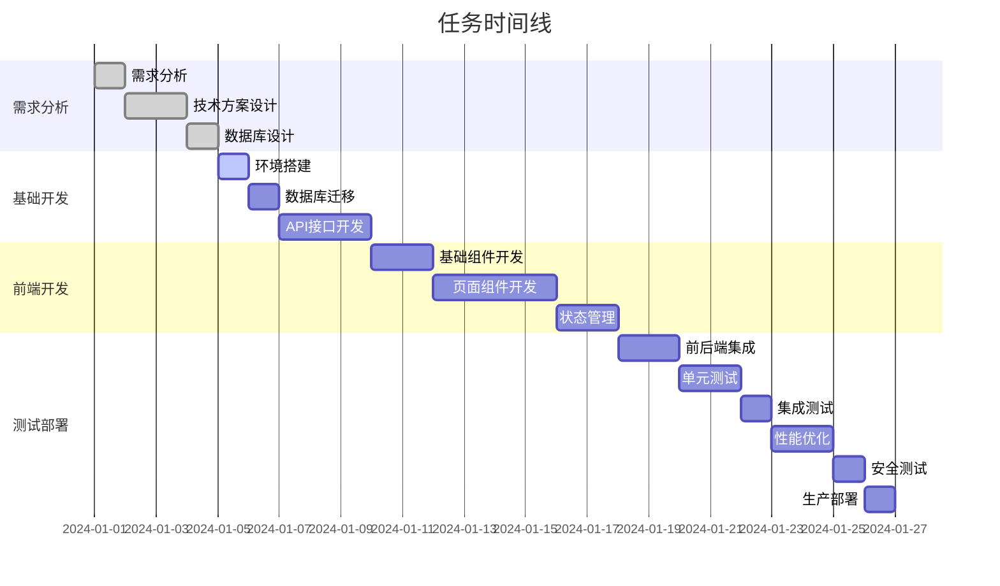

# 任务清单: 项目质量标准升级

## 项目信息
**项目名称**: OpenAero 项目质量标准升级  
**创建日期**: 2024年12月  
**负责人**: 开发团队  
**状态**: 进行中  

## 任务概览
- **总任务数**: 24
- **已完成**: 3
- **进行中**: 1
- **待开始**: 20
- **完成率**: 12.5%

## 阶段 1: 代码质量标准化 (第1-2周)

### 1.1 ESLint 和 Prettier 优化
- [x] **T001**: 分析现有 ESLint 配置
  - **负责人**: 开发团队
  - **预计时间**: 0.5天
  - **状态**: ✅ 已完成
  - **完成日期**: 2024-12-XX

- [x] **T002**: 安装额外的 ESLint 插件
  - **负责人**: 开发团队
  - **预计时间**: 0.5天
  - **状态**: ✅ 已完成
  - **依赖**: T001
  - **详情**: 
    ```bash
    npm install --save-dev @typescript-eslint/eslint-plugin
    npm install --save-dev eslint-plugin-react-hooks
    npm install --save-dev eslint-plugin-jsx-a11y
    npm install --save-dev eslint-plugin-import
    npm install --save-dev eslint-plugin-unused-imports
    ```

- [x] **T003**: 更新 ESLint 配置文件
  - **负责人**: 开发团队
  - **预计时间**: 1天
  - **状态**: ✅ 已完成
  - **依赖**: T002
  - **详情**: 配置严格的 ESLint 规则，包括代码质量、可访问性、React hooks 等规则

- [ ] **T004**: 修复现有代码的 ESLint 错误
  - **负责人**: 开发团队
  - **预计时间**: 2天
  - **状态**: 🔄 进行中
  - **依赖**: T003
  - **优先级**: 高
  - **详情**: 逐步修复项目中的 ESLint 错误和警告

- [ ] **T005**: 优化 Prettier 配置
  - **负责人**: 开发团队
  - **预计时间**: 0.5天
  - **状态**: ⏳ 待开始
  - **依赖**: T004
  - **优先级**: 中

### 1.2 TypeScript 严格模式配置
- [ ] **T006**: 启用 TypeScript 严格模式
  - **负责人**: 开发团队
  - **预计时间**: 1天
  - **状态**: ⏳ 待开始
  - **优先级**: 高
  - **详情**: 更新 tsconfig.json，启用所有严格模式选项

- [ ] **T007**: 修复 TypeScript 严格模式错误
  - **负责人**: 开发团队
  - **预计时间**: 3天
  - **状态**: ⏳ 待开始
  - **依赖**: T006
  - **优先级**: 高

### 1.3 Pre-commit Hooks 配置
- [ ] **T008**: 安装和配置 Husky
  - **负责人**: 开发团队
  - **预计时间**: 0.5天
  - **状态**: ⏳ 待开始
  - **优先级**: 中

- [ ] **T009**: 配置 lint-staged
  - **负责人**: 开发团队
  - **预计时间**: 0.5天
  - **状态**: ⏳ 待开始
  - **依赖**: T008
  - **优先级**: 中

### 1.4 代码复杂度检查
- [ ] **T010**: 集成代码复杂度检查工具
  - **负责人**: 开发团队
  - **预计时间**: 1天
  - **状态**: ⏳ 待开始
  - **优先级**: 中

## 阶段 2: 测试体系完善 (第2-3周)

### 2.1 Jest 配置优化
- [ ] **T011**: 修复 Jest 配置中的 moduleNameMapping 错误
  - **负责人**: 开发团队
  - **预计时间**: 0.5天
  - **状态**: ⏳ 待开始
  - **优先级**: 高
  - **详情**: 修复 jest.config.js 中的路径映射配置

- [ ] **T012**: 配置测试覆盖率阈值
  - **负责人**: 开发团队
  - **预计时间**: 0.5天
  - **状态**: ⏳ 待开始
  - **依赖**: T011
  - **优先级**: 高

- [ ] **T013**: 创建测试工具和 Mock 数据
  - **负责人**: 开发团队
  - **预计时间**: 1天
  - **状态**: ⏳ 待开始
  - **优先级**: 中

### 2.2 单元测试编写
- [ ] **T014**: 为核心组件编写单元测试
  - **负责人**: 开发团队
  - **预计时间**: 3天
  - **状态**: ⏳ 待开始
  - **依赖**: T013
  - **优先级**: 高

- [ ] **T015**: 为工具函数编写单元测试
  - **负责人**: 开发团队
  - **预计时间**: 2天
  - **状态**: ⏳ 待开始
  - **优先级**: 中

### 2.3 E2E 测试完善
- [ ] **T016**: 优化 Playwright 配置
  - **负责人**: 开发团队
  - **预计时间**: 1天
  - **状态**: ⏳ 待开始
  - **优先级**: 中

- [ ] **T017**: 编写核心用户流程的 E2E 测试
  - **负责人**: 开发团队
  - **预计时间**: 2天
  - **状态**: ⏳ 待开始
  - **依赖**: T016
  - **优先级**: 高

## 阶段 3: CI/CD 流程优化 (第3-4周)

### 3.1 GitHub Actions 工作流
- [ ] **T018**: 完善 CI 工作流配置
  - **负责人**: 开发团队
  - **预计时间**: 1天
  - **状态**: ⏳ 待开始
  - **优先级**: 高
  - **详情**: 更新 .github/workflows/ci.yml

- [ ] **T019**: 配置质量门禁工作流
  - **负责人**: 开发团队
  - **预计时间**: 1天
  - **状态**: ⏳ 待开始
  - **依赖**: T018
  - **优先级**: 高

- [ ] **T020**: 集成安全扫描工具
  - **负责人**: 开发团队
  - **预计时间**: 1天
  - **状态**: ⏳ 待开始
  - **优先级**: 中

### 3.2 部署流程优化
- [ ] **T021**: 配置多环境部署策略
  - **负责人**: 开发团队
  - **预计时间**: 1天
  - **状态**: ⏳ 待开始
  - **优先级**: 中

## 阶段 4: 监控和可观测性 (第4周)

### 4.1 错误追踪和监控
- [ ] **T022**: 集成 Sentry 错误追踪
  - **负责人**: 开发团队
  - **预计时间**: 1天
  - **状态**: ⏳ 待开始
  - **优先级**: 高

- [ ] **T023**: 配置性能监控
  - **负责人**: 开发团队
  - **预计时间**: 1天
  - **状态**: ⏳ 待开始
  - **优先级**: 中

- [ ] **T024**: 建立日志系统
  - **负责人**: 开发团队
  - **预计时间**: 1天
  - **状态**: ⏳ 待开始
  - **优先级**: 中

## 任务依赖关系


## 资源分配
- **开发人员**: {developer_count}人
- **测试人员**: {tester_count}人
- **设计人员**: {designer_count}人
- **项目经理**: {pm_count}人

## 风险控制
### 高风险任务
- **TASK-008**: 页面组件开发 - 复杂度高，需要UI/UX支持
- **TASK-010**: 前后端集成 - 可能存在接口不匹配问题

### 风险缓解措施
- 提前进行技术预研
- 增加代码审查环节
- 准备备选方案

## 质量检查点
- [ ] 代码审查通过
- [ ] 单元测试覆盖率达标
- [ ] 集成测试通过
- [ ] 性能测试通过
- [ ] 安全测试通过
- [ ] 用户验收测试通过

## 交付物清单
- [ ] 源代码
- [ ] 技术文档
- [ ] 用户手册
- [ ] 部署文档
- [ ] 测试报告
- [ ] 性能报告

## 备注
{additional_notes}
